# [実践] JMeterを使ってAWS環境Webアプリケーションを性能検証する② 環境構築(1) AWS編

導入編からの続きです。CloudFormation を用いて AWS のサーバ・ネットワーク構築を行います。

まずは Web サイトと JMeter の動作確認が出来れば良いので、インスタンスタイプはすべて t3.micro、シングル構成で構築します。

まずは構築方法を先に、その後で各コードの解説をしていきます。

# AWS構成

## システム概要図

まずは本システムのおさらいです。

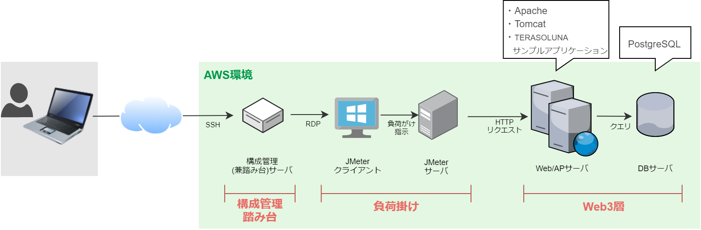

* 本システムは、構成管理兼踏み台、負荷掛け、Web3層の3つのパートからなります。
* AWSの構成管理には CloudFormation を、各サーバのミドルウェアの管理には Ansible を使用します。
* Webアプリへの負荷掛けは JMeter サーバ/クライアントを通して行います。
* Webサーバには Apache httpd と Tomcat、アプリケーションは [TERASOLUNAサンプルアプリケーション](https://github.com/terasolunaorg/terasoluna-tourreservation)を使用します。
* DBエンジンは PostgreSQL を採用します。


## AWS構成図

AWS 構成図は以下となります。

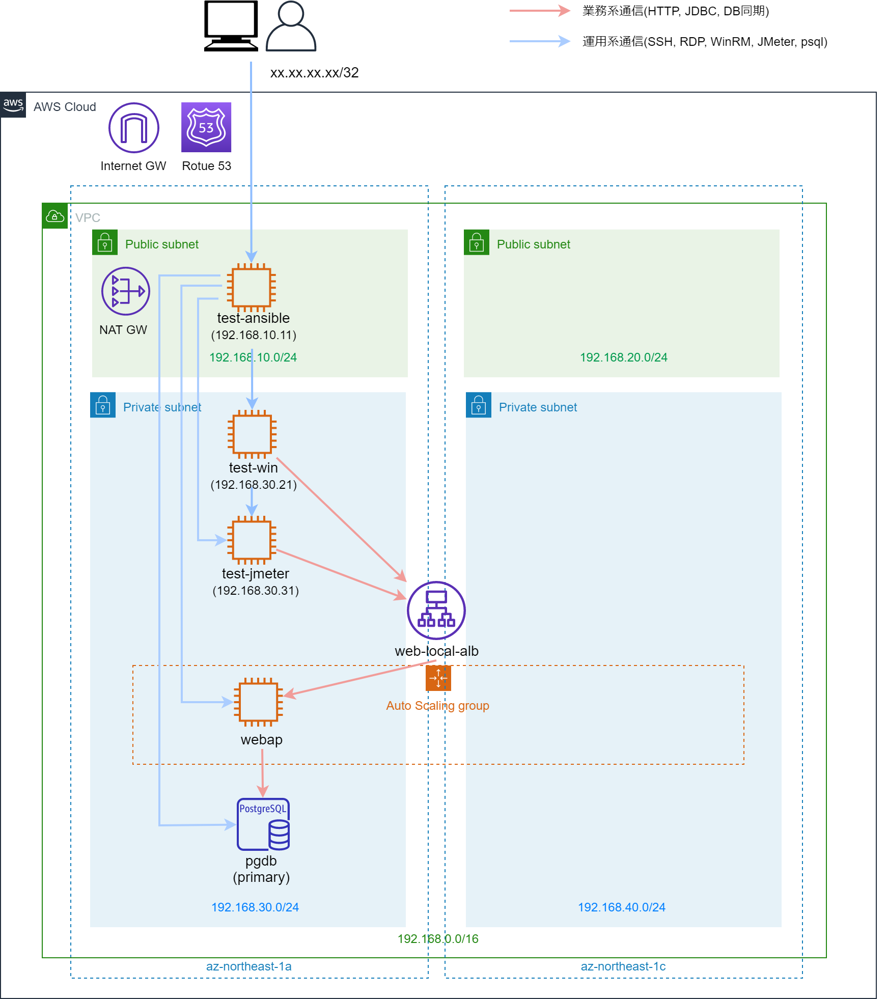

## 内部 ELB を使う理由

通常、一般公開する Web サイトではインターネット向け ALB を採用しますが（下図）、本システムでは採用せず、内部 ALB を使用します。

インターネット向け ALB を使用した場合、作業用PC の JMeter から大量のアクセスをする場合、 作業用PC側のネットワーク回線がボトルネックとなる可能性があります。

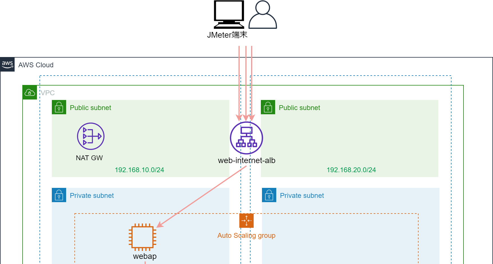

しかし、実際にシステムが使われる場合、複数の端末からアクセスされるため、ネットワーク回線がボトルネックになることはありません。


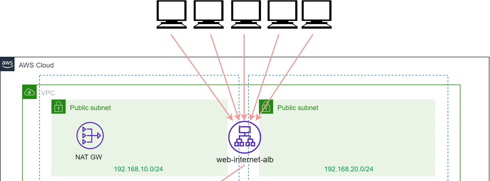

性能試験では、AWS環境内に JMeterサーバを導入し、かつ内部 ALB を使用することにより回線のボトルネックが起きないようにしています。

# 構築方法
AWSコンソールで Administrator アカウントを使用して構築していきます。

## 鍵作成
EC2 コンソールからキーペアを作成していきます。

https://docs.aws.amazon.com/ja_jp/AWSEC2/latest/UserGuide/ec2-key-pairs.html

形式は pem で、名前は「key-performance-test」で作成してください。
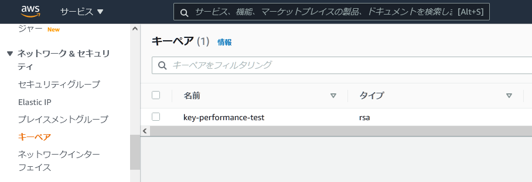

## CloudFormation のスタック作成

github リポジトリに CloudFormation のコードを公開しています。まずはこちらを clone か、zipダウンロードしてください。

https://github.com/muroya2355/aws_performance_test

01_AWS_Cfn フォルダ中に yaml ファイルが入っています。構成は以下の通り。各 yaml ファイルのコード詳細は後述します。

|ファイル名|スタック名|リソース|
|-|-|-|
|01_cloudformation-network.yaml	|performance-test-VPC		|VPC/サブネット/GW/ルートテーブル|
|02_cloudformation-IAMRole.yaml	|performance-test-IAMRole	|EC2用IAMロール|
|03_cloudformation-TestEC2.yaml	|performance-test-TestEC2	|構成管理サーバ/JMterクライアント/JMeterサーバ|
|04_cloudformation-WebAPEC2.yaml|performance-test-WebAP		|WebAPサーバ起動設定/ASG/内部ELB|
|05_cloudformation-RDS.yaml		|performance-test-RDS		|RDSインスタンス|
|06_cloudformation-DNS.yaml		|performance-test-DNS		|WebAP用Aレコード/DB用CNAMEレコード|

AWSコンソールの CloudFormation サービスで順番にスタックを作成していきましょう。手順は以下を参考にしてください。

https://qiita.com/mshinoda88/items/c5b238212c2de850efdd#5-cloudformation%E5%AE%9F%E8%A1%8C

ただし、スタック「performance-test-TestEC2」を作成する際、パラメータ「FromIPSegment」が未定になっています。これは作業PCのグローバルIPアドレス（ルータ、プロキシサーバ等のアドレス）を指定してください。家庭用ルータを使用している場合は、IPアドレスがこまめに変更されるので、こまめにスタックを更新してください。

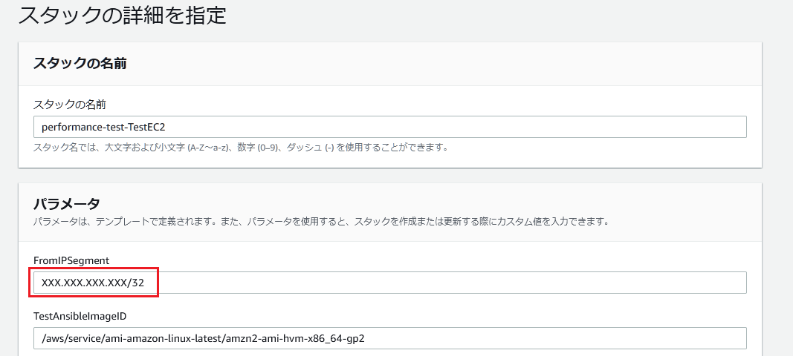

## ログイン確認

各サーバにログインできるか確認してください。(筆者は TeraTerm で接続します。セッションマネージャでも可)

また構成管理サーバには、各サーバ接続用の秘密鍵を配置します。

### 構成管理サーバ

TeraTerm で 構成管理サーバに接続して下さい。IPアドレスは構成管理サーバのパブリックIPアドレス、鍵は key-performance-test.pem を使用してください。

https://dev.classmethod.jp/articles/aws-beginner-ec2-ssh/

ログインが確認出来たら、サーバの ~/.ssh フォルダに key-performance-test.pem を転送します。転送後、鍵のパーミッションを 600 に設定してください。

https://qiita.com/go-to/items/409e32116213bdf4b1ce

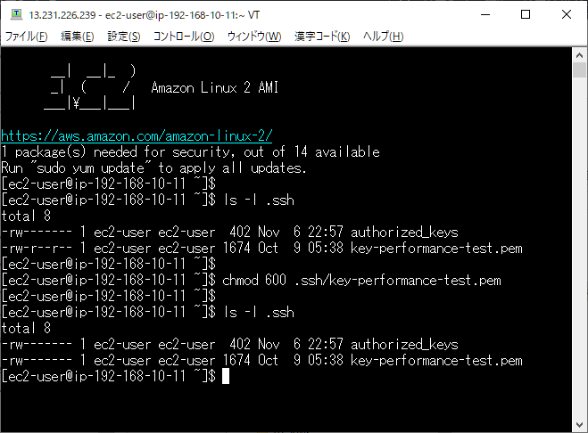

この鍵を用いて、構成管理から JMeterサーバ、WebAPサーバに接続します。

### JMeter クライアント

まずは Windows ログインのためのパスワードを取得してください。

https://aws.amazon.com/jp/premiumsupport/knowledge-center/retrieve-windows-admin-password/

TereTerm で構成管理サーバに接続したままポート転送を設定し、JMeter クライアントに RDP 接続できるようにします。

https://dev.classmethod.jp/articles/rdp-via-bastion-server/

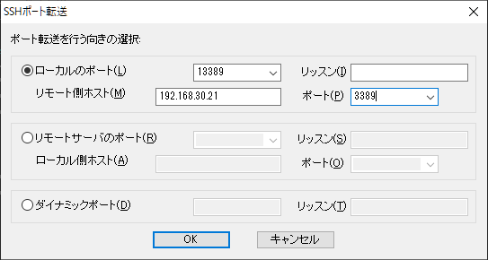
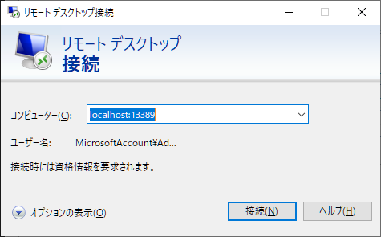
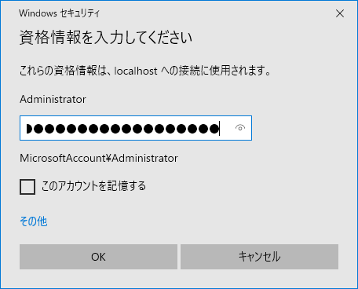

### JMeter サーバ

構成管理サーバから JMeter サーバに SSH 接続してください。

```
ssh -i .ssh/key-performance-test.pem 192.168.30.31
```

### WebAPサーバ

同様に構成管理サーバから WebAP サーバに SSH 接続してください。

```
ssh -i .ssh/key-performance-test.pem [WebAPサーバのIPアドレス]
```

### DB サーバ

psql コマンドでデータベースにログインします。

```
psql -h db.tourreserve.local -U postgres -d tourreserve
Password for user postgres: P0stgres
tourreserve=> \q
```


ここまで出来たら構築は完了です。以降は、各 CloudFormation コードの解説をしていきます。


# CloudFormation 詳細

## VPC 関連

まずは、VPC、サブネット、インターネットGWと NAT-GW、ルートテーブルを作成しましょう。

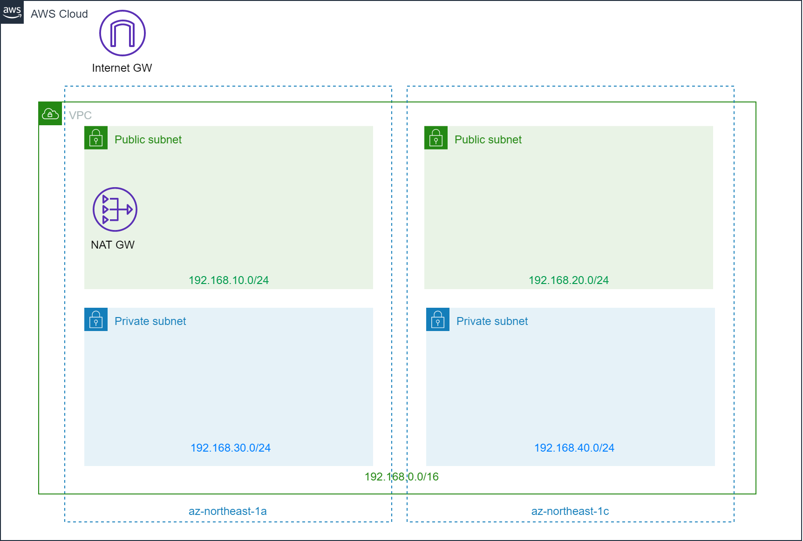

<details><summary>CloudFormation コード（クリックして展開）</summary><div>

```yaml:01_cloudformation-network.yaml
---
  AWSTemplateFormatVersion: '2010-09-09'
  Description: 'VPC/Subnet/RTB/IGW/NAT-GW'
  
  # ------------------------
  # パラメータ定義：VPC/サブネットのNWセグメント
  # ------------------------
  Parameters:
  # VPCセグメント
    VpcBlock:
      Type: String
      Default: 192.168.0.0/16

  # 各サブネットのセグメント
    PublicSubnet01Block:
      Type: String
      Default: 192.168.10.0/24
    PublicSubnet02Block:
      Type: String
      Default: 192.168.20.0/24 
    PrivateSubnet01Block:
      Type: String
      Default: 192.168.30.0/24
    PrivateSubnet02Block:
      Type: String
      Default: 192.168.40.0/24  

  
  Resources:
  # ------------------------
  # VPC定義
  # ------------------------
    VPC:
      Type: AWS::EC2::VPC
      Properties:
        CidrBlock:  !Ref VpcBlock
        EnableDnsHostnames: true
        EnableDnsSupport: true
        Tags:
        - Key: Name
          Value: !Sub '${AWS::StackName}'

  # ------------------------
  # サブネット定義
  # ------------------------
    # AZ-Aパブリックサブネット
    PublicSubnet01:
      Type: AWS::EC2::Subnet
      Metadata:
        Comment: PublicSubnet01
      Properties:
        AvailabilityZone:
          Fn::Select:
          - '0'
          - Fn::GetAZs:
              Ref: AWS::Region
        CidrBlock:
          Ref: PublicSubnet01Block
        VpcId:
          Ref: VPC
        Tags:
        - Key: Name
          Value: !Sub "${AWS::StackName}-PublicSubnet01"

    # AZ-Cパブリックサブネット
    PublicSubnet02:
      Type: AWS::EC2::Subnet
      Metadata:
        Comment: PublicSubnet02
      Properties:
        AvailabilityZone:
          Fn::Select:
          - '1'
          - Fn::GetAZs:
              Ref: AWS::Region
        CidrBlock:
          Ref: PublicSubnet02Block
        VpcId:
          Ref: VPC
        Tags:
        - Key: Name
          Value: !Sub "${AWS::StackName}-PublicSubnet02"

    # AZ-Aプライベートサブネット
    PrivateSubnet01:
      Type: AWS::EC2::Subnet
      Metadata:
        Comment: PrivateSubnet01
      Properties:
        AvailabilityZone:
          Fn::Select:
          - '0'
          - Fn::GetAZs:
              Ref: AWS::Region
        CidrBlock:
          Ref: PrivateSubnet01Block
        VpcId:
          Ref: VPC
        Tags:
        - Key: Name
          Value: !Sub "${AWS::StackName}-PrivateSubnet01"
    
    # AZ-Cプライベートサブネット
    PrivateSubnet02:
      Type: AWS::EC2::Subnet
      Metadata:
        Comment: PrivateSubnet02
      Properties:
        AvailabilityZone:
          Fn::Select:
          - '1'
          - Fn::GetAZs:
              Ref: AWS::Region
        CidrBlock:
          Ref: PrivateSubnet02Block
        VpcId:
          Ref: VPC
        Tags:
        - Key: Name
          Value: !Sub "${AWS::StackName}-PrivateSubnet02"

  # ------------------------
  # インターネットGW/NAT-GW定義
  # ------------------------
    # インターネットGW
    InternetGateway:
      Type: "AWS::EC2::InternetGateway"
      Properties:
        Tags:
        - Key: Name
          Value: !Sub "${AWS::StackName}"

    # インターネットGWをVPCにアタッチ
    VPCGatewayAttachment:
      Type: "AWS::EC2::VPCGatewayAttachment"
      Properties:
        InternetGatewayId: !Ref InternetGateway
        VpcId: !Ref VPC

    # NAT-GW用のEIP
    NatGatewayEIP:
      Type: 'AWS::EC2::EIP'
      Properties:
        Domain: vpc

    # NAT-GW
    NatGateway:
      DependsOn:
      - NatGatewayEIP
      - PublicSubnet01
      Type: AWS::EC2::NatGateway
      Properties:
        AllocationId: !GetAtt 'NatGatewayEIP.AllocationId'
        SubnetId: !Ref PublicSubnet01
        Tags:
        - Key: Name
          Value: !Sub '${AWS::StackName}-NATGW-AZ-A'

  # ------------------------
  # 各サブネットのルートテーブル定義
  # ------------------------
    # パブリックルートテーブル定義
    PublicRouteTable:
      Type: AWS::EC2::RouteTable
      Properties:
        VpcId: !Ref VPC
        Tags:
        - Key: Name
          Value: PublicSubnets
        - Key: Network
          Value: Public

    # パブリックRTBのルーティング情報
    PublicRoute:
      DependsOn: VPCGatewayAttachment
      Type: AWS::EC2::Route
      Properties:
        RouteTableId: !Ref PublicRouteTable
        DestinationCidrBlock: 0.0.0.0/0
        GatewayId: !Ref InternetGateway

    # プライベートルートテーブル定義
    PrivateRouteTable:
      Type: AWS::EC2::RouteTable
      Properties:
        VpcId: !Ref VPC
        Tags:
        - Key: Name
          Value: PrivateSubnets
        - Key: Network
          Value: Private

    # プライベートRTBのルーティング情報
    PrivateRoute:
      DependsOn:
      - NatGateway
      Type: AWS::EC2::Route
      Properties:
        RouteTableId: !Ref PrivateRouteTable
        DestinationCidrBlock: 0.0.0.0/0
        NatGatewayId: !Ref NatGateway

    # 各ルートテーブルをサブネットにアタッチ
    PublicSubnet01RouteTableAssociation:
      Type: AWS::EC2::SubnetRouteTableAssociation
      Properties:
        SubnetId: !Ref PublicSubnet01
        RouteTableId: !Ref PublicRouteTable
  
    PublicSubnet02RouteTableAssociation:
      Type: AWS::EC2::SubnetRouteTableAssociation
      Properties:
        SubnetId: !Ref PublicSubnet02
        RouteTableId: !Ref PublicRouteTable
  
    PrivateSubnet01RouteTableAssociation:
      Type: AWS::EC2::SubnetRouteTableAssociation
      Properties:
        SubnetId: !Ref PrivateSubnet01
        RouteTableId: !Ref PrivateRouteTable

    PrivateSubnet02RouteTableAssociation:
      Type: AWS::EC2::SubnetRouteTableAssociation
      Properties:
        SubnetId: !Ref PrivateSubnet02
        RouteTableId: !Ref PrivateRouteTable

  # ------------------------
  # リソースID出力
  # ------------------------
  Outputs:
    # VPCのID
    VPCID:
      Description: The VPC Id
      Value: !Ref VPC
      Export:
        Name: VPCID

    # パブリックサブネットのID
    PublicSubnetIDs:
      Description: Public Subnet IDs in the VPC
      Value: !Join [ ",", [ !Ref PublicSubnet01, !Ref PublicSubnet02 ] ]
      Export:
        Name: PublicSubnetIDs

    # プライベートサブネットのID
    PrivateSubnetIDs:
      Description: Private Subnet IDs in the VPC
      Value: !Join [ ",", [ !Ref PrivateSubnet01, !Ref PrivateSubnet02 ] ]
      Export:
        Name: PrivateSubnetIDs
  
```

</div></details>

ここら辺は、他の記事でも多く取り上げられているので、特筆すべき項目はありません。

スタックの出力で、複数サブネットのIDをカンマ区切りの文字列で出力しています。

```yaml
# パブリックサブネットのID
PublicSubnetIDs:
  Description: Public Subnet IDs in the VPC
  # 2つのサブネットをカンマ区切りで文字列結合
  # subnet-xx,subnet-yy の形で出力される
  Value: !Join [ ",", [ !Ref PublicSubnet01, !Ref PublicSubnet02 ] ]
  Export:
    Name: PublicSubnetIDs
```

こうすることで、のちのスタックで AZ-A/AZ-C それぞれのサブネットをインデックスで指定できます。

```yaml
# AZ-A のパブリックサブネットを指定したい場合、
# まずカンマで文字列分割しリスト形式に。
# その後インデックス0(一番目)のサブネットを指定している
SubnetId: !Select [0, !Split [",", !ImportValue PublicSubnetIDs]]
```


## IAM ロール

EC2 インスタンスにアタッチする IAM ロールを作成します。

本当は、試験用 EC2 と WebAP用EC2 でポリシーを分けるべきですが、簡単のためにすべて同じポリシーを使用します。

|ポリシー名|用途|
|-|-|
|AmazonSSMManagedInstanceCore|セッションマネージャで各 Linux インスタンスに接続可とするため|
|CloudWatchAgentServerPolicy|各サーバのメモリ監視で cloudwatch-agent を使用するため|
|AmazonEC2FullAccess		|構成管理サーバから各サーバのプロビジョニングをするため|
|AmazonRDSFullAccess		|構成管理サーバから RDS に接続するため|

<details><summary>CloudFormation コード（クリックして展開）</summary><div>

```yaml:02_cloudformation-IAMRole.yaml
---
  AWSTemplateFormatVersion: '2010-09-09'
  Description: 'IAM role for EC2'
  
  Resources:
    EC2IAMRole:
      Type: "AWS::IAM::Role"
      Properties:
        AssumeRolePolicyDocument:
          Statement: 
            -
              Effect: "Allow"
              Principal:
                Service:
                  - "ec2.amazonaws.com"
              Action:
                - "sts:AssumeRole"
        Path: "/"
        RoleName: 'EC2IAMRole'
        ManagedPolicyArns:
        - arn:aws:iam::aws:policy/AmazonSSMManagedInstanceCore
        - arn:aws:iam::aws:policy/CloudWatchAgentServerPolicy
        - arn:aws:iam::aws:policy/AmazonEC2FullAccess
        - arn:aws:iam::aws:policy/AmazonRDSFullAccess

  Outputs:
    EC2IAMRole:
      Value: !Ref EC2IAMRole
      Export:
        Name: EC2IAMRole
```

</div></details>


## 試験用 EC2

構成管理サーバ、JMeterクライアント、JMeterサーバを作成していきます。

インスタンス起動の際、ユーザデータにより必要なパッケージのインストールを行います。

また、各サーバのセキュリティグループを作成し、通信許可設定を行います。

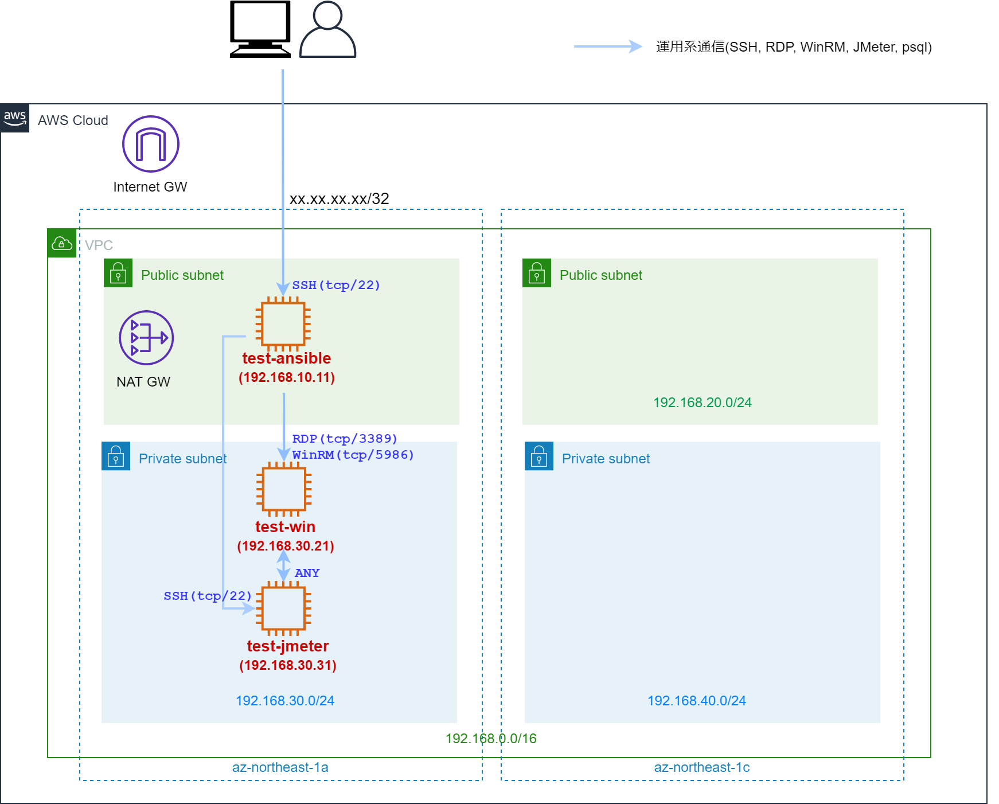

|サーバ|インスタンス名|OS|ユーザデータ内容|接続元|
|-|-|-|-|-|
|構成管理サーバ	|test-ansible|Amazon Linux 2|git,ansible,psql等のインストール|作業用PC|
|JMeterクライアント|test-win|Windows Server 2019|ansibleからWinRM経由で操作可とするための設定|構成管理サーバ, JMeterサーバ|
|JMeterサーバ|test-jmeter|Amazon Linux 2|-|構成管理サーバ, JMeterクライアント|

<details><summary>CloudFormation コード（クリックして展開）</summary><div>

```yaml:03_cloudformation-TestEC2.yaml
---
  AWSTemplateFormatVersion: '2010-09-09'
  Description: 'TestEC2/SG/Key'
  
  Parameters:
  # ------------------------
  # 構成管理サーバ用パラメータ
  # ------------------------
    TestAnsiblePrivateIP:
      Type: String
      Default: 192.168.10.11
    TestAnsibleImageID:
      Type: AWS::SSM::Parameter::Value<String>
      Default: /aws/service/ami-amazon-linux-latest/amzn2-ami-hvm-x86_64-gp2
    TestAnsibleInstanceType:
      Type: String
      Default: t3.micro
    TestAnsibleKeyName:
      Type: "AWS::EC2::KeyPair::KeyName"
      Default: "key-performance-test"
    FromIPSegment:
      Type: String
      Default: XXX.XXX.XXX.XXX/32
  # ------------------------
  # JMeterクライアント用パラメータ
  # ------------------------
    TestWinPrivateIP:
      Type: String
      Default: 192.168.30.21
    TestWinImageID:
      Type: AWS::SSM::Parameter::Value<String>
      Default: /aws/service/ami-windows-latest/Windows_Server-2019-Japanese-Full-Base
    TestWinInstanceType:
      Type: String
      Default: t3.micro
  # ------------------------
  # JMeterサーバ用パラメータ
  # ------------------------
    TestJemeterPrivateIP:
      Type: String
      Default: 192.168.30.31
    TestJemeterImageID:
      Type: AWS::SSM::Parameter::Value<String>
      Default: /aws/service/ami-amazon-linux-latest/amzn2-ami-hvm-x86_64-gp2
    TestJemeterInstanceType:
      Type: String
      Default: t3.micro
    TestJemeterKeyName:
      Type: "AWS::EC2::KeyPair::KeyName"
      Default: "key-performance-test"


  Resources:
  # ------------------------
  # 構成管理サーバ
  # ------------------------
    # セキュリティグループ
    TestAnsibleSG:
      Type: AWS::EC2::SecurityGroup
      Properties:
        GroupName: sg_testansible
        GroupDescription: "SG for TestAnsible"
        VpcId: !ImportValue VPCID
        # 作業用PCからの通信を許可
        SecurityGroupIngress:
          - IpProtocol: tcp
            FromPort: 22
            ToPort: 22
            CidrIp: !Ref FromIPSegment

    # IAMロールからインスタンスプロファイルの設定
    TestAnsibleIAMInstanceProfile:
      Type: "AWS::IAM::InstanceProfile"
      Properties:
        Path: "/"
        Roles:
        - !ImportValue EC2IAMRole

    # インスタンス設定
    TestAnsibleInstance:
      Type: AWS::EC2::Instance
      Properties: 
        # 基本設定
        ImageId: !Ref TestAnsibleImageID
        KeyName: !Ref TestAnsibleKeyName
        InstanceType: !Ref TestAnsibleInstanceType
        # ネットワーク設定
        NetworkInterfaces:
          - AssociatePublicIpAddress: "true"
            DeviceIndex: "0"
            SubnetId: !Select [0, !Split [",", !ImportValue PublicSubnetIDs]]
            PrivateIpAddress: !Ref TestAnsiblePrivateIP
            GroupSet:
              - !Ref TestAnsibleSG
        # EBS設定
        BlockDeviceMappings:
        - DeviceName: /dev/sda1
          Ebs:
            VolumeType: gp2
            VolumeSize: 8
            DeleteOnTermination: true
        # IAMロールをインスタンスにアタッチ
        IamInstanceProfile: !Ref TestAnsibleIAMInstanceProfile
        # ユーザデータの設定（必要パッケージのインストール）
        UserData:
          Fn::Base64: |
            #!/bin/bash
            sudo yum install -y git
            sudo amazon-linux-extras install -y python3.8
            sudo pip3.8 install --upgrade pip
            /usr/local/bin/pip3.8 install ansible
            /usr/local/bin/pip3.8 install boto3 botocore
            /usr/local/bin/pip3.8 install pywinrm
            sudo yum -y install postgresql.x86_64
            source .bash_profile
        # タグ設定
        Tags:
            - Key: Name
              Value: test-ansible
            - Key: Application
              Value: ansible


  # ------------------------
  # TestWindows用リソース
  # ------------------------
    # セキュリティグループ
    TestWinSG:
      Type: AWS::EC2::SecurityGroup
      Properties:
        GroupName: sg_testwin
        GroupDescription: "SG for TestWin"
        VpcId: !ImportValue VPCID
        SecurityGroupIngress:
          # 構成管理サーバからの通信を許可
          - IpProtocol: tcp
            FromPort: 3389
            ToPort: 3389
            SourceSecurityGroupId: !Ref TestAnsibleSG
          - IpProtocol: tcp
            FromPort: 5986
            ToPort: 5986
            SourceSecurityGroupId: !Ref TestAnsibleSG

    TestWinSecurityGroupIngress:
      Type: AWS::EC2::SecurityGroupIngress
      Properties:
        # JMeterサーバからの通信を許可
        GroupId: !Ref TestWinSG
        IpProtocol: -1
        SourceSecurityGroupId: !Ref TestJemeterSG

    # IAMロールからインスタンスプロファイルの設定
    TestWinIAMInstanceProfile:
      Type: "AWS::IAM::InstanceProfile"
      Properties:
        Path: "/"
        Roles:
        - !ImportValue EC2IAMRole

    # インスタンス設定
    TestWinInstance:
      Type: AWS::EC2::Instance
      Properties: 
        # 基本設定
        ImageId: !Ref TestWinImageID
        KeyName: !Ref TestAnsibleKeyName
        InstanceType: !Ref TestWinInstanceType
        # ネットワーク設定
        NetworkInterfaces:
          - DeviceIndex: "0"
            SubnetId: !Select [0, !Split [",", !ImportValue PrivateSubnetIDs]]
            PrivateIpAddress: !Ref TestWinPrivateIP
            GroupSet:
              - !Ref TestWinSG
        # EBS設定
        BlockDeviceMappings:
        - DeviceName: /dev/sda1
          Ebs:
            VolumeType: gp2
            VolumeSize: 30
            DeleteOnTermination: true
        # IAMロールをインスタンスにアタッチ
        IamInstanceProfile: !Ref TestWinIAMInstanceProfile
        # ユーザデータの設定（AnsibleからWinRMでリモート操作の許可）
        UserData:
          Fn::Base64: |
            <powershell>
            $url = "https://raw.githubusercontent.com/ansible/ansible/devel/examples/scripts/ConfigureRemotingForAnsible.ps1"
            $file = "$env:temp\ConfigureRemotingForAnsible.ps1"
            (New-Object -TypeName System.Net.WebClient).DownloadFile($url, $file)
            powershell.exe -ExecutionPolicy ByPass -File $file
            </powershell>
        # タグ設定
        Tags:
            - Key: Name
              Value: test-win
            - Key: Application
              Value: windows


  # ------------------------
  # TestJemeter用リソース
  # ------------------------
    # セキュリティグループ
    TestJemeterSG:
      Type: AWS::EC2::SecurityGroup
      Properties:
        GroupName: sg_testjemeter
        GroupDescription: "SG for TestJemeter"
        VpcId: !ImportValue VPCID
        SecurityGroupIngress:
          # 構成管理サーバからの接続許可
          - IpProtocol: tcp
            FromPort: 22
            ToPort: 22
            SourceSecurityGroupId: !Ref TestAnsibleSG
          # JMeterクライアントからの接続許可
          - IpProtocol: -1
            SourceSecurityGroupId: !Ref TestWinSG

    # IAMロールからインスタンスプロファイルの設定
    TestJemeterIAMInstanceProfile:
      Type: "AWS::IAM::InstanceProfile"
      Properties:
        Path: "/"
        Roles:
        - !ImportValue EC2IAMRole

    # インスタンス設定
    TestJemeterInstance:
      Type: AWS::EC2::Instance
      Properties: 
        # 基本設定
        ImageId: !Ref TestJemeterImageID
        KeyName: !Ref TestJemeterKeyName
        InstanceType: !Ref TestJemeterInstanceType
        # ネットワーク設定
        NetworkInterfaces:
          - DeviceIndex: "0"
            SubnetId: !Select [0, !Split [",", !ImportValue PrivateSubnetIDs]]
            PrivateIpAddress: !Ref TestJemeterPrivateIP
            GroupSet:
              - !Ref TestJemeterSG
        # EBS設定
        BlockDeviceMappings:
        - DeviceName: /dev/sda1
          Ebs:
            VolumeType: gp2
            VolumeSize: 8
            DeleteOnTermination: true
        # IAMロールをインスタンスにアタッチ
        IamInstanceProfile: !Ref TestJemeterIAMInstanceProfile
        # タグ設定
        Tags:
            - Key: Name
              Value: test-jmeter
            - Key: Application
              Value: jmeter-server

  # ------------------------
  # リソースID出力
  # ------------------------
  Outputs:
    TestAnsibleSG:
      Value: !Ref TestAnsibleSG
      Export:
        Name: TestAnsibleSG
    TestWinSG:
      Value: !Ref TestWinSG
      Export:
        Name: TestWinSG
    TestJemeterSG:
      Value: !Ref TestJemeterSG
      Export:
        Name: TestJemeterSG
```

</div></details>

ユーザデータの内容については、次章の Ansible の回で解説していきます。

SG（セキュリティグループ）について。JMeter クライアントと JMeter サーバは相互通信を行うため、お互いの SG に対向の SG を記述する必要がありますが、CloudFormation では循環参照となるため、設定できません。

```yaml
# JMeterクライアント用セキュリティグループ
TestWinSG:
  Type: AWS::EC2::SecurityGroup
  Properties:
    GroupName: sg_testwin
    GroupDescription: "SG for TestWin"
    VpcId: !ImportValue VPCID
    SecurityGroupIngress:
      # JMeterサーバからの接続許可
      - IpProtocol: -1
        SourceSecurityGroupId: !Ref TestJemeterSG

# JMeterサーバ用セキュリティグループ
TestJemeterSG:
  Type: AWS::EC2::SecurityGroup
  Properties:
    GroupName: sg_testjemeter
    GroupDescription: "SG for TestJemeter"
    VpcId: !ImportValue VPCID
    SecurityGroupIngress:
      # JMeterクライアントからの接続許可
      # 循環参照のエラーとなる
      - IpProtocol: -1
        SourceSecurityGroupId: !Ref TestWinSG
```

テンプレート検証を行うと、以下のエラーが発生します。

```
Circular dependency between resources: [TestJemeterSG, TestWinSG]
```

これを回避するために、JMeterクライアント用 SG のリソース設定ではサーバ用 SG を書かず、のちに SecurityGroupIngress のリソースを作成し、SG に追加します。

```yaml
# JMeterクライアント用セキュリティグループ
TestWinSG:
  Type: AWS::EC2::SecurityGroup
  Properties:
    GroupName: sg_testwin
    GroupDescription: "SG for TestWin"
    VpcId: !ImportValue VPCID

# SG Ingress
TestWinSecurityGroupIngress:
  Type: AWS::EC2::SecurityGroupIngress
  Properties:
    # JMeterサーバからの通信を許可
    GroupId: !Ref TestWinSG
    IpProtocol: -1
    SourceSecurityGroupId: !Ref TestJemeterSG

# JMeterサーバ用セキュリティグループ
TestJemeterSG:
  Type: AWS::EC2::SecurityGroup
  Properties:
    GroupName: sg_testjemeter
    GroupDescription: "SG for TestJemeter"
    VpcId: !ImportValue VPCID
    SecurityGroupIngress:
      # JMeterクライアントからの接続許可
      - IpProtocol: -1
        SourceSecurityGroupId: !Ref TestWinSG
```

https://dev.classmethod.jp/articles/cloudformation-knowhow/


## WebAPサーバ、内部ELB

いよいよ WebAPサーバと ELB を作成します。

WebAPサーバは先ほどの試験用 EC2 とは違い、EC2インスタンスの起動設定と ASG（AutoScalingGroup）の組み合わせで作成していきます。

|サーバ|インスタンス名|OS|台数(希望/最小/最大)|接続元|
|-|-|-|-|-|
|WebAPサーバ|webap|Amazon Linux 2|1/1/1|内部ELB, 構成管理サーバ|

また、ASG を ELB のターゲットグループに登録し、ELB への通信リクエストが WebAP サーバに振り分けられるようにします。

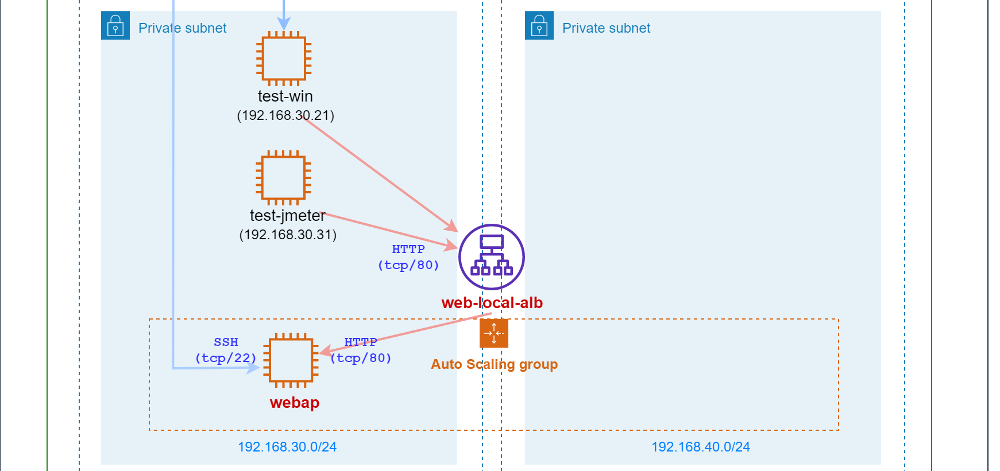

<details><summary>CloudFormation コード（クリックして展開）</summary><div>

```yaml:04_cloudformation-WebAPEC2.yaml

---
  AWSTemplateFormatVersion: '2010-09-09'
  Description: 'WebAP EC2/ASG'

  # ------------------------
  # WebAPサーバ用パラメータ
  # ------------------------
  Parameters:
    EC2ImageID:
      Type: AWS::SSM::Parameter::Value<String>
      Default: /aws/service/ami-amazon-linux-latest/amzn2-ami-hvm-x86_64-gp2
    KeyName:
      Type: "AWS::EC2::KeyPair::KeyName"
      Default: "key-performance-test"
    EC2InstanceType:
      Type: String
      Default: t3.micro
    NumberOfServers:
      Type: String
      Default: 1

  Resources:
  # ------------------------
  # Web/APサーバ用
  # ------------------------
    # セキュリティグループ
    WebAPEC2SG:
      Type: AWS::EC2::SecurityGroup
      Properties:
        GroupName: sg_webap
        GroupDescription: "SG for WebAPEC2"
        VpcId: !ImportValue VPCID
        SecurityGroupIngress:
          # 内部ELBからの接続許可
          - IpProtocol: tcp
            FromPort: 80
            ToPort: 80
            SourceSecurityGroupId: !Ref WebAPLocalALBSG
          # 構成管理サーバからの接続許可
          - IpProtocol: tcp
            FromPort: 22
            ToPort: 22
            SourceSecurityGroupId: !ImportValue TestAnsibleSG

    # IAMロールからインスタンスプロファイルの設定
    WebAPEC2IAMInstanceProfile:
      Type: "AWS::IAM::InstanceProfile"
      Properties:
        Path: "/"
        Roles:
        - !ImportValue EC2IAMRole

    # EC2インスタンス起動設定
    WebAPLaunchTemplate:
      Type: AWS::EC2::LaunchTemplate
      Properties:
        LaunchTemplateName: WebAPLaunchTemplate
        LaunchTemplateData:
          # 基本設定
          ImageId: !Ref EC2ImageID
          KeyName: !Ref KeyName
          InstanceType: !Ref EC2InstanceType
          # ネットワーク設定
          NetworkInterfaces:
          - AssociatePublicIpAddress: "false"
            DeviceIndex: "0"
            Groups:
              - !Ref WebAPEC2SG
          # IAMロールをインスタンスにアタッチ
          IamInstanceProfile:
            Arn: !GetAtt
              - WebAPEC2IAMInstanceProfile
              - Arn
          # 拡張モニタリングを有効化
          Monitoring:
            Enabled: true
          # タグ設定
          TagSpecifications:
          - ResourceType: instance
            Tags:
            - Key: Name
              Value: webap-launchsetting

    # ASG
    WebAPAutoScalingGroup:
      Type: AWS::AutoScaling::AutoScalingGroup
      Properties:
        AutoScalingGroupName: WebAPAutoScalingGroup
        # サブネット設定(AZ-A/AZ-Cのプライベートサブネット)
        VPCZoneIdentifier:
          - !Select [0, !Split [",", !ImportValue PrivateSubnetIDs]]
          - !Select [1, !Split [",", !ImportValue PrivateSubnetIDs]]
        # EC2起動設定を指定
        LaunchTemplate:
          LaunchTemplateId: !Ref WebAPLaunchTemplate
          Version: !GetAtt WebAPLaunchTemplate.LatestVersionNumber
        # 内部ELBのターゲットグループに登録
        TargetGroupARNs:
          - !Ref WebAPLocalTargetGroup
        # サーバ台数設定(1台)
        DesiredCapacity: !Ref NumberOfServers
        MaxSize: !Ref NumberOfServers
        MinSize: !Ref NumberOfServers
        # タグ設定
        Tags:
          - Key: Name
            Value: webap
            PropagateAtLaunch: true
          - Key: Application
            Value: tour-reservation
            PropagateAtLaunch: true

  # ------------------------
  # 内部ELB
  # ------------------------

    # セキュリティグループ
    WebAPLocalALBSG:
      Type: AWS::EC2::SecurityGroup
      Properties:
        GroupName: sg_webapalb-local
        GroupDescription: "SG for WebAPLocalALB"
        VpcId: !ImportValue VPCID
        SecurityGroupIngress:
          # JMeterクライアントからの通信許可
          - IpProtocol: tcp
            FromPort: 80
            ToPort: 80
            SourceSecurityGroupId: !ImportValue  TestWinSG
          # JMeterサーバからの通信許可
          - IpProtocol: tcp
            FromPort: 80
            ToPort: 80
            SourceSecurityGroupId: !ImportValue  TestJemeterSG

    # ターゲットグループ
    WebAPLocalTargetGroup: 
      Type: "AWS::ElasticLoadBalancingV2::TargetGroup"
      Properties: 
        VpcId: !ImportValue VPCID
        Name: WebAPLocalTargetGroup
        # 振分け先ポート(HTTP:80)
        Protocol: HTTP
        Port: 80
        # ヘルスチェック設定
        HealthCheckProtocol: HTTP
        HealthCheckPath: "/"
        HealthCheckPort: "traffic-port"
        HealthyThresholdCount: 5
        UnhealthyThresholdCount: 2
        HealthCheckTimeoutSeconds: 5
        HealthCheckIntervalSeconds: 10
        Matcher: 
          HttpCode: 200
        Tags: 
          - Key: Name

    # 内部ELB
    WebAPLocalALB:
      Type: "AWS::ElasticLoadBalancingV2::LoadBalancer"
      Properties: 
        Name: WebAPLocalALB
        Tags: 
          - Key: Name
            Value: webapelb-local
        Scheme: "internal"
        LoadBalancerAttributes:
          - Key: "deletion_protection.enabled"
            Value: false
          - Key: "idle_timeout.timeout_seconds"
            Value: 60
        SecurityGroups:
          - !Ref WebAPLocalALBSG
        Subnets: 
          - !Select [0, !Split [",", !ImportValue PrivateSubnetIDs]]
          - !Select [1, !Split [",", !ImportValue PrivateSubnetIDs]]

    # ELBリスナー設定
    WebAPLocalALBListener: 
      Type: "AWS::ElasticLoadBalancingV2::Listener"
      Properties: 
        DefaultActions:
          # ターゲットグループ設定
          - TargetGroupArn: !Ref WebAPLocalTargetGroup
            Type: forward
        LoadBalancerArn: !Ref WebAPLocalALB
        # 受付ポート(HTTP:80)
        Port: 80
        Protocol: HTTP

  # ------------------------
  # リソースID出力
  # ------------------------
  Outputs:
    WebAPEC2SG:
      Value: !Ref WebAPEC2SG
      Export:
        Name: WebAPEC2SG
    WebAPLocalALBID:
      Value: !GetAtt WebAPLocalALB.CanonicalHostedZoneID
      Export:
        Name: WebAPLocalALBID
    WebAPLocalALBDNS:
      Value: !GetAtt WebAPLocalALB.DNSName
      Export:
        Name: WebAPLocalALBDNS
```

</div></details>

こちらはコードを読めば大体分かると思います。

最後、出力パラメータで ELB の CanonicalHostedZoneID と DNSName（例：internal-WebAPLocalALB-xxxxxxx.ap-northeast-1.elb.amazonaws.com） を出力しています。

こちらは後程 DNS 設定で使用します。

## DB サーバ

次はDB サーバです。RDS で構築していきます。

TERASOLUNA アプリケーションで使うデータベースも作成します。

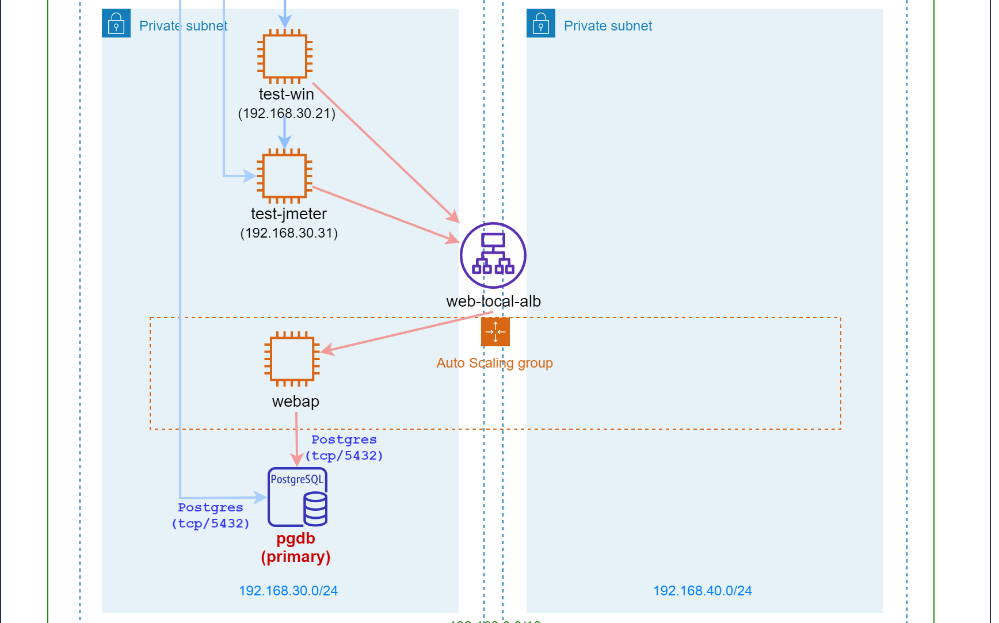

|パラメータ|値|
|-|-|
|インスタンス名|pgdb|
|PostgreSQLバージョン|12.8|
|データベース|tourreserve|
|DBユーザ名|postgres|
|DBユーザパスワード|P0stgres|


<details><summary>CloudFormation コード（クリックして展開）</summary><div>

```yaml:05_cloudformation-RDS.yaml
---
  AWSTemplateFormatVersion: '2010-09-09'
  Description: 'DB (RDS/SG)'

  # ----------------
  # DBパラメータ設定
  # ----------------
  Parameters:
    # インスタンスID
    DBInstanceID:
      Type: String
      Default: db
    # データベース名
    DatabaseName:
      Type: String
      Default: tourreserve
    # PostgreSQLバージョン
    RDSEngineVersion:
      Type: String
      Default: 12.8
    # インスタンスタイプ
    RDSInstanceType:
      Type: String
      Default: db.t3.micro
    # ストレージサイズ
    DBAllocatedStorage:
      Type: String
      Default: 20
    # ストレージタイプ
    DBStorageType:
      Type: String
      Default: "gp2"
    # マルチAZを有効化するか
    isMultiAZ:
      Type: String
      Default: false
    # DBユーザ名
    DBUserName:
      Type: String
      Default: postgres
    # DBユーザパスワード
    DBUserPassword:
      NoEcho: true
      Type: String
      Default: P0stgres


  Resources:

    # DBパラメータグループ
    DBParameterGroup:
      Type: "AWS::RDS::DBParameterGroup"
      Properties:
        Family: postgres12
        Description: DB Parameter Group

    # DBを配置するサブネットグループ
    DBSubnetGroup:
      Type: AWS::RDS::DBSubnetGroup
      Properties:
        DBSubnetGroupDescription: Subnet for DB instance
        SubnetIds:
          - !Select [0, !Split [",", !ImportValue PrivateSubnetIDs]]
          - !Select [1, !Split [",", !ImportValue PrivateSubnetIDs]]

    # セキュリティグループ
    DBSG:
      Type: AWS::EC2::SecurityGroup
      Properties:
        GroupDescription: SG for DB instance
        VpcId: !ImportValue VPCID
        SecurityGroupIngress:
          # WebAPサーバからの通信許可
          - IpProtocol: tcp
            FromPort: 5432
            ToPort: 5432
            SourceSecurityGroupId: !ImportValue WebAPEC2SG
          # 構成管理サーバからの通信許可
          - IpProtocol: tcp
            FromPort: 5432
            ToPort: 5432
            SourceSecurityGroupId: !ImportValue TestAnsibleSG

    # DBサーバ
    DB:
      Type: AWS::RDS::DBInstance
      Properties:
        # インスタンス設定
        DBInstanceIdentifier: !Ref DBInstanceID
        DBName: !Ref DatabaseName
        Engine: postgres
        EngineVersion: !Ref RDSEngineVersion
        MultiAZ: !Ref isMultiAZ
        DBInstanceClass: !Ref RDSInstanceType
        AllocatedStorage: !Ref DBAllocatedStorage
        StorageType: !Ref DBStorageType
        MasterUsername: !Ref DBUserName
        MasterUserPassword: !Ref DBUserPassword
        # パラメータグループ
        DBParameterGroupName: !Ref DBParameterGroup
        # セキュリティグループ
        VPCSecurityGroups:
          - !Ref DBSG
        # サブネットグループ
        DBSubnetGroupName: !Ref DBSubnetGroup
        # タグ設定
        Tags:
          - Key: Name
            Value: pgdb

  # ----------------
  # パラメータ出力
  # ----------------
  Outputs:
    DBInstanceID:
      Value: !Ref DB
      Export:
        Name: DBInstanceID

    DBInstanceEndpoint:
      Value: !GetAtt DB.Endpoint.Address
      Export:
        Name: DBInstanceEndpoint
```

</div></details>

こちらも最後にDBエンドポイントを出力しており、DNS 設定で使用します。

## DNS 設定

VPC 内のみ有効なプライベートホストゾーン「tourreserve.com」を作成します。

また、ホストゾーン内に以下の DNS レコードを作成します。

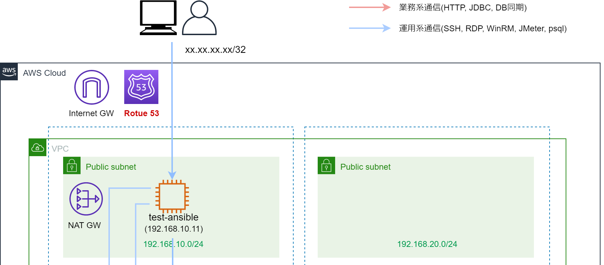

|FQDN|レコード区分|名前解決先|
|-|-|-|
|local.www.tourreserve.com|Aレコード|内部ELBエンドポイント|
|local.db.tourreserve.com|CNAMEレコード|DBエンドポイント|

<details><summary>CloudFormation コード（クリックして展開）</summary><div>

```yaml:06_cloudformation-DNS.yaml
---
  AWSTemplateFormatVersion: '2010-09-09'
  Description: 'DNS'

  # ----------------
  # DNSパラメータ設定
  # ----------------
  Parameters:
    PrivateHostedZoneName:
      Type: String
      Default: tourreserve.com

  Resources:
    # プライベートホストゾーン設定
    PrivateHostedZone:
      Type: AWS::Route53::HostedZone
      Properties:
        Name:
          !Ref PrivateHostedZoneName
        VPCs:
          - VPCId:
              !ImportValue VPCID
            VPCRegion:
              Fn::Sub: "${AWS::Region}"

    # 内部ELB用Aレコード
    LocalELBDNSRecordSet:
      DependsOn: PrivateHostedZone
      Type: AWS::Route53::RecordSet
      Properties:
        HostedZoneId: !Ref PrivateHostedZone
        Name: !Sub local.www.${PrivateHostedZoneName}
        Type: A
        AliasTarget:
          HostedZoneId: !ImportValue WebAPLocalALBID
          DNSName: !ImportValue WebAPLocalALBDNS

    # DB用CNAMEレコード
    DBDNSRecordSet:
      DependsOn: PrivateHostedZone
      Type: AWS::Route53::RecordSet
      Properties:
        HostedZoneId: !Ref PrivateHostedZone
        Name: !Sub local.db.${PrivateHostedZoneName}
        Type: CNAME
        TTL: '300'
        ResourceRecords:
        - !ImportValue DBInstanceEndpoint
```

</div></details>


# おわりに

これで CloudFormation での構築は完了です。

次回は Ansible で各サーバをプロビジョニングしていきます。
