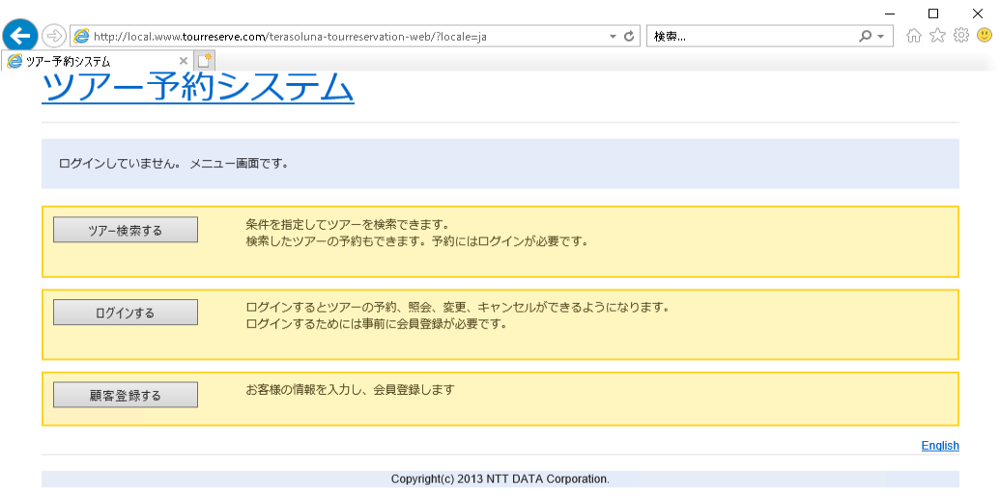

# [実践] JMeterを使ってAWS環境Webアプリケーションを性能検証する③ 環境構築(2) Ansible編

環境構築(1) AWS編からの続きです。Ansible を用いて各サーバをプロビジョニングしていきます。

今回も、構築方法を先に、その後で各 Ansible コードの解説を行います。

# ソフトウェア構成

## ソフトウェア構成図


黒細字のソフトウェアはインストール済です。黒太字のソフトウェアをインストールしていきます。

また、構成管理サーバでアプリケーションをビルドし、WebAPサーバにデプロイします。

## Ansible 構成

Ansible のファイル構成は以下になります。


# 構築方法

## Ansible インストール

EC2 ユーザデータで実施済ですが、Ansibleのインストールコマンドは以下です。

```sh:構成管理サーバ
# python3.8のインストール
$ sudo amazon-linux-extras install -y python3.8
# python3.8と同時にpip3.8もインストールされるが、バージョンが古いためアップグレードする
$ sudo pip3.8 install --upgrade pip
# pip3.8でansibleをインストール
$ /usr/local/bin/pip3.8 install ansible
# 本システムで必要となるパッケージのインストール
$ /usr/local/bin/pip3.8 install boto3 botocore
$ /usr/local/bin/pip3.8 install pywinrm
```

## WinRMの実行許可設定

こちらも EC2 ユーザデータで実施済ですが、Ansible から Windows の JMeter クライアントを操作するために、Powershell で以下のコマンドを実行します。

```powershell:JMeterクライアント
> $url = "https://raw.githubusercontent.com/ansible/ansible/devel/examples/scripts/ConfigureRemotingForAnsible.ps1"
> $file = "$env:temp\ConfigureRemotingForAnsible.ps1"
> (New-Object -TypeName System.Net.WebClient).DownloadFile($url, $file)
> powershell.exe -ExecutionPolicy ByPass -File $file
```

https://goodbyegangster.hatenablog.com/entry/2019/04/09/073408

## Ansible 動作確認

まずは git でリポジトリをクローンしてください。

```sh:構成管理サーバ
$ cd ~
$ git clone https://github.com/muroya2355/aws_performance_test.git
$ cd aws_performance_test/02_Ansible/
$ ls
inventory_aws_ec2.yaml  roles              test-jmeter-client.yaml  webap.yaml
playbook.yaml           test-ansible.yaml  test-jmeter-server.yaml
```

インベントリファイルのチェックし、ホスト一覧を取得します。以下のようにホスト一覧が表示されればOKです。

```sh:構成管理サーバ
$ ansible-inventory -i inventory_aws_ec2.yaml --graph
@all:
  |--@aws_ec2:
  |  |--test-ansible
  |  |--test-jmeter
  |  |--test-win
  |  |--webap
  |--@tag_ansible:
  |  |--test-ansible
  |--@tag_jmeter_server:
  |  |--test-jmeter
  |--@tag_tour_reservation:
  |  |--webap
  |--@tag_windows:
  |  |--test-win
  |--@ungrouped:
```

## Playbook 実行

各サーバに対して Playbook を実行していきます。

### 構成管理サーバ

まずは構成管理サーバ自身から。

```sh:構成管理サーバ
$ ansible-playbook test-ansible.yaml
[WARNING]: No inventory was parsed, only implicit localhost is available
[WARNING]: provided hosts list is empty, only localhost is available. Note that
the implicit localhost does not match 'all'

PLAY [deploy testservers] ******************************************************

TASK [Gathering Facts] *********************************************************
ok: [localhost]

TASK [cloudwatch_agent : cloudwatch agent のインストール] **********************
changed: [localhost]

(中略)

TASK [build_ap : アプリケーションのビルド] *************************************
changed: [localhost]

PLAY RECAP *********************************************************************
localhost                  : ok=26   changed=22   unreachable=0    failed=0    skipped=0    rescued=0    ignored=0
```

### JMeter クライアント

JMeter クライアントは Windows のため、鍵認証でなくパスワード認証でログインします。

test-jmeter-client.yaml を編集し、Administrator のパスワードを書いてください。

```yaml:test-jmeter-client.yaml
---
- name: deploy jmeter-server
  hosts: "{{ target_hosts }}"

  vars:
    ansible_user: Administrator
    ansible_password: "xxxxxx"  ← ここにパスワードを記入
    ansible_connection: winrm
    ansible_port: 5986
    ansible_winrm_server_cert_validation: ignore

  roles:
    - jmeter-client
```

編集後、Playbook を実行します。

```sh:構成管理サーバ
$ ansible-playbook -i inventory_aws_ec2.yaml test-jmeter-client.yaml -e "target_hosts=tag_windows"
PLAY [deploy jmeter-server] ****************************************************

TASK [Gathering Facts] *********************************************************
ok: [test-win]

TASK [jmeter-client : Windows ファイアウォールの無効化] ************************
changed: [test-win]

(中略)


PLAY RECAP *********************************************************************
test-win                   : ok=7    changed=6    unreachable=0    failed=0    skipped=0    rescued=0    ignored=0
```

### JMeter サーバ

次は JMeter サーバです。

```sh:構成管理サーバ
$ ansible-playbook -i inventory_aws_ec2.yaml test-jmeter-server.yaml -e "target_hosts=tag_jmeter_server"

PLAY [deploy webservers] *******************************************************

TASK [Gathering Facts] *********************************************************

(中略)

TASK [jmeter-server : サービスの起動] ******************************************
changed: [test-jmeter]

PLAY RECAP *********************************************************************
test-jmeter                : ok=20   changed=17   unreachable=0    failed=0    skipped=0    rescued=0    ignored=0
```

### WebAP サーバ

最後に WebAP サーバに対して Playbook 実行します。

```sh:構成管理サーバ
$ ansible-playbook -i inventory_aws_ec2.yaml webap.yaml -e "target_hosts=tag_tour_reservation"

PLAY [deploy webservers] *******************************************************

(中略)

TASK [deploy_ap : warファイルを取得] *******************************************
changed: [webap]

PLAY RECAP *********************************************************************
webap                      : ok=32   changed=29   unreachable=0    failed=0    skipped=0    rescued=0    ignored=0
```

## アプリケーション動作確認

JMeter クライアントに RDP 接続して、Internet Explorer を開いてください。

アドレスバーに ``http://local.www.tourreserve.com/terasoluna-tourreservation-web/`` を入力してアクセスします。

途中、警告画面が出るので、サイトを例外に追加してください。

  

トップページが表示されたらOKです。右下の「日本語」ボタンを押して日本語表記にしてください。

 

各メニューの動作確認をしてみましょう。

* ツアー検索
	* 「ツアー検索する」ボタンをクリック
	* 以下の条件で検索
		* 出発日：そのまま
		* 日数：制限なし
		* 出発地：北海道
		* 目的地：北海道
		* 人数：大人 1 人、子供 1 人
		* 基本料金：上限なし
	* ツアーが表示されればOK

* ログイン
	* 「ログインする」ボタンをクリック
	* 以下の情報でログイン
		* 会員ID：00000000
		* パスワード：password
	* ユーザのメニュー画面が表示されればOK

* 顧客登録
	* 「顧客登録する」ボタンをクリック
	* 以下の情報で登録
		* フリガナ：シケンロクロウ
		* 氏名：試験六郎
		* 誕生日：1980年1月1日
		* 職業：営業
		* Eメール：data6@example.com
		* 電話番号：123-1234-1234
		* 郵便番号：135-8671
		* 住所：東京都江東区豊洲3-3-9
		* パスワード：password
	* 確認画面が表示されるので、そのまま登録
	* 登録完了画面が表示され、「お客様の会員IDは 00000012」と出てくればOK
	* 会員ID「00000012」でログインできるようになります。

# Ansible コードの解説


