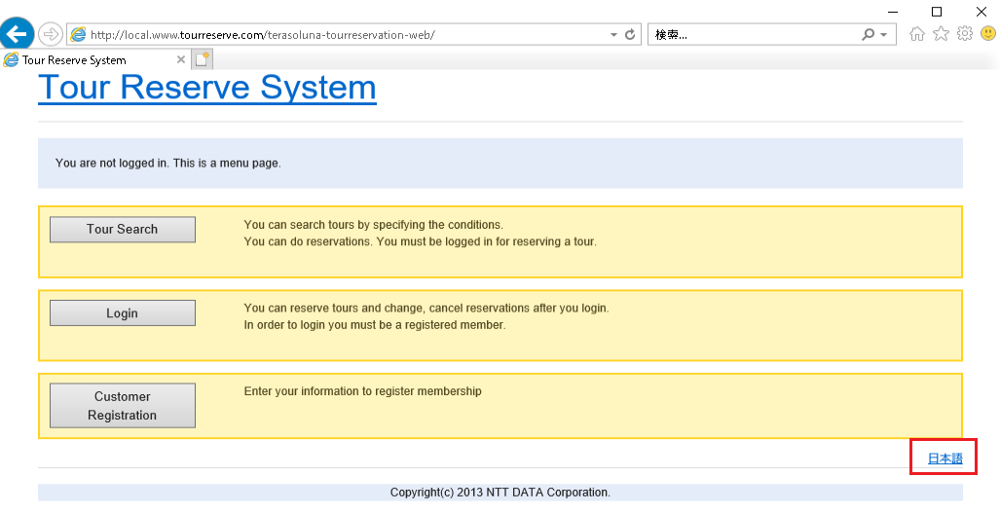

# [実践] JMeterを使ってAWS環境Webアプリケーションを性能検証する③ 環境構築(2) Ansible編

環境構築(1) AWS編からの続きです。Ansible を用いて各サーバをプロビジョニングしていきます。  
今回も、構築方法を先に、その後で各 Ansible コードの解説を行います。

# ソフトウェア構成

## ソフトウェア構成図


黒細字のソフトウェアはインストール済です。黒太字のソフトウェアをインストールしていきます。  
また、構成管理サーバでアプリケーションをビルドし、WebAPサーバにデプロイします。

## Ansible 構成

Ansible のファイル構成は以下になります。


# 構築方法

## Ansible インストール

EC2 ユーザデータで実施済ですが、Ansibleのインストールコマンドは以下です。

```sh:構成管理サーバ
# python3.8のインストール
$ sudo amazon-linux-extras install -y python3.8
# python3.8と同時にpip3.8もインストールされるが、バージョンが古いためアップグレードする
$ sudo pip3.8 install --upgrade pip
# pip3.8でansibleをインストール
$ /usr/local/bin/pip3.8 install ansible
# 本システムで必要となるパッケージのインストール
$ /usr/local/bin/pip3.8 install boto3 botocore
$ /usr/local/bin/pip3.8 install pywinrm
```

## WinRMの実行許可設定

こちらも EC2 ユーザデータで実施済ですが、Ansible から Windows の JMeter クライアントを操作するために、Powershell で以下のコマンドを実行します。（参考[[1]](https://goodbyegangster.hatenablog.com/entry/2019/04/09/073408)）

```powershell:JMeterクライアント
> $url = "https://raw.githubusercontent.com/ansible/ansible/devel/examples/scripts/ConfigureRemotingForAnsible.ps1"
> $file = "$env:temp\ConfigureRemotingForAnsible.ps1"
> (New-Object -TypeName System.Net.WebClient).DownloadFile($url, $file)
> powershell.exe -ExecutionPolicy ByPass -File $file
```

## Ansible 動作確認

まずは git でリポジトリをクローンしてください。

```sh:構成管理サーバ
$ cd ~
$ git clone https://github.com/muroya2355/aws_performance_test.git
$ cd aws_performance_test/02_Ansible/
$ ls
inventory_aws_ec2.yaml  roles              test-jmeter-client.yaml  webap.yaml
playbook.yaml           test-ansible.yaml  test-jmeter-server.yaml
```

インベントリファイルのチェックし、ホスト一覧を取得します。以下のようにホスト一覧が表示されればOKです。

```sh:構成管理サーバ
$ ansible-inventory -i inventory_aws_ec2.yaml --graph
@all:
  |--@aws_ec2:
  |  |--test-ansible
  |  |--test-jmeter
  |  |--test-win
  |  |--webap
  |--@tag_ansible:
  |  |--test-ansible
  |--@tag_jmeter_server:
  |  |--test-jmeter
  |--@tag_tour_reservation:
  |  |--webap
  |--@tag_windows:
  |  |--test-win
  |--@ungrouped:
```

## Playbook 実行

各サーバに対して Playbook を実行していきます。

### 構成管理サーバ

まずは構成管理サーバ自身から。

```sh:構成管理サーバ
$ ansible-playbook test-ansible.yaml
[WARNING]: No inventory was parsed, only implicit localhost is available
[WARNING]: provided hosts list is empty, only localhost is available. Note that
the implicit localhost does not match 'all'

PLAY [deploy testservers] ******************************************************

TASK [Gathering Facts] *********************************************************
ok: [localhost]

TASK [cloudwatch_agent : cloudwatch agent のインストール] **********************
changed: [localhost]

(中略)

TASK [build_ap : アプリケーションのビルド] *************************************
changed: [localhost]

PLAY RECAP *********************************************************************
localhost                  : ok=26   changed=22   unreachable=0    failed=0    skipped=0    rescued=0    ignored=0
```

### JMeter クライアント

JMeter クライアントは Windows のため、鍵認証でなくパスワード認証でログインします。

test-jmeter-client.yaml を編集し、Administrator のパスワードを書いてください。

```yaml:test-jmeter-client.yaml
---
- name: deploy jmeter-server
  hosts: "{{ target_hosts }}"

  vars:
    ansible_user: Administrator
    ansible_password: "xxxxxx"  ← ここにパスワードを記入
    ansible_connection: winrm
    ansible_port: 5986
    ansible_winrm_server_cert_validation: ignore

  roles:
    - jmeter-client
```

編集後、Playbook を実行します。

```sh:構成管理サーバ
$ ansible-playbook -i inventory_aws_ec2.yaml test-jmeter-client.yaml -e "target_hosts=tag_windows"
PLAY [deploy jmeter-server] ****************************************************

TASK [Gathering Facts] *********************************************************
ok: [test-win]

TASK [jmeter-client : Windows ファイアウォールの無効化] ************************
changed: [test-win]

(中略)


PLAY RECAP *********************************************************************
test-win                   : ok=7    changed=6    unreachable=0    failed=0    skipped=0    rescued=0    ignored=0
```

### JMeter サーバ

次は JMeter サーバです。

```sh:構成管理サーバ
$ ansible-playbook -i inventory_aws_ec2.yaml test-jmeter-server.yaml -e "target_hosts=tag_jmeter_server"

PLAY [deploy webservers] *******************************************************

TASK [Gathering Facts] *********************************************************

(中略)

TASK [jmeter-server : サービスの起動] ******************************************
changed: [test-jmeter]

PLAY RECAP *********************************************************************
test-jmeter                : ok=20   changed=17   unreachable=0    failed=0    skipped=0    rescued=0    ignored=0
```

### WebAP サーバ

最後に WebAP サーバに対して Playbook 実行します。

```sh:構成管理サーバ
$ ansible-playbook -i inventory_aws_ec2.yaml webap.yaml -e "target_hosts=tag_tour_reservation"

PLAY [deploy webservers] *******************************************************

(中略)

TASK [deploy_ap : warファイルを取得] *******************************************
changed: [webap]

PLAY RECAP *********************************************************************
webap                      : ok=32   changed=29   unreachable=0    failed=0    skipped=0    rescued=0    ignored=0
```

## アプリケーション動作確認

Webサイトが正常に動作するか確認しましょう。JMeter の動作確認は次回に行います。

JMeter クライアントに RDP 接続して、Internet Explorer を開いてください。

アドレスバーに ``http://local.www.tourreserve.com/terasoluna-tourreservation-web/`` を入力してアクセスします。

途中、警告画面が出るので、サイトを例外に追加してください。

  

トップページが表示されたらOKです。右下の「日本語」ボタンを押して日本語表記にしてください。

 

各メニューの動作確認をしてみましょう。

* ツアー検索
	* 「ツアー検索する」ボタンをクリック
	* 以下の条件で検索
		* 出発日：そのまま
		* 日数：制限なし
		* 出発地：北海道
		* 目的地：北海道
		* 人数：大人 1 人、子供 1 人
		* 基本料金：上限なし
	* ツアーが表示されればOK

* ログイン
	* 「ログインする」ボタンをクリック
	* 以下の情報でログイン
		* 会員ID：00000000
		* パスワード：password
	* ユーザのメニュー画面が表示されればOK

* 顧客登録
	* 「顧客登録する」ボタンをクリック
	* 以下の情報で登録
		* フリガナ：シケンロクロウ
		* 氏名：試験六郎
		* 誕生日：1980年1月1日
		* 職業：営業
		* Eメール：data6@example.com
		* 電話番号：123-1234-1234
		* 郵便番号：135-8671
		* 住所：東京都江東区豊洲3-3-9
		* パスワード：password
	* 確認画面が表示されるので、そのまま登録
	* 登録完了画面が表示され、「お客様の会員IDは 00000012」と出てくればOK
	* 会員ID「00000012」でログインできるようになります。


# Ansible コードの解説

## ダイナミックインベントリ

Ansible の実行対象を記述するインベントリファイルは、本来、対象サーバの IP アドレスを記述していきます。

```
[tag_ansible]
localhost
[tag_jmeter_server]
192.168.30.31
[tag_tour_reservation]
192.168.40.180          ← 動的に変化
[tag_windows]
192.168.30.21
```

しかし、EC2 の IPアドレス（今回はWebAPサーバ）は動的に変化するため、この方法では都度インベントリを書き直す必要があります。この手間を省くための仕組みが、ダイナミックインベントリです。(参考[[2]](https://zenn.dev/ohsawa0515/articles/enable-ec2-dynamic-inventory-by-ansible))

EC2インスタンス作成時に、Application タグを付与しています。

|サーバ|Nameタグ|Applicationタグ|
|-|-|-|
|構成管理サーバ|test-ansible|ansible|
|JMeterクライアント|test-win|windows|
|JMeterサーバ|test-jmeter|jmeter_server|
|WebAPサーバ|webap|tour_reservation|

このタググループ毎に、playbook を適用していきます。

まずは必要パッケージをインストール。

```sh:構成管理サーバ
/usr/local/bin/pip3.8 install boto3 botocore
```

インベントリファイルを記述していきます。  
ファイル名の末尾は aws_ec2.yaml とする必要があります。

```yaml:inventory_aws_ec2.yaml
# プラグインのロード
plugin: aws_ec2
# EC2インスタンスがあるリージョンを指定
reginos:
  - ap-northeast-1

# 実行中のインスタンスのみ選択
filters:
  instance-state-name: running

# Applicationタグでグルーピング
keyed_groups:
  - key: tags.Application
    prefix: tag_
    separator: ""

# NameタグとプライベートIP蒼dレスを抽出
hostnames:
  - tag:Name
  - private-ip-address

compose:
  ansible_host: private_ip_address

# インスタンス情報をキャッシュとして保存(10分)
cache: yes
cache_plugin: jsonfile
cache_timeout: 600
cache_connection: $HOME/aws_performance_test/aws_inventory
```

実行すると、先述のように Application タグごとにグルーピングされます

```sh:構成管理サーバ
$ ansible-inventory -i inventory_aws_ec2.yaml --graph
@all:
  |--@aws_ec2:
  (省略)
  |--@tag_ansible:
  |  |--test-ansible
  |--@tag_jmeter_server:
  |  |--test-jmeter
  |--@tag_tour_reservation:
  |  |--webap
  |--@tag_windows:
  |  |--test-win
  |--@ungrouped:
```

グループを指定して playbook 実行する場合は、以下のようにします。

```sh:構成管理サーバ
$ ansible-playbook -i inventory_aws_ec2.yaml test-jmeter-client.yaml -e "target_hosts=tag_windows"
```

## Ansible ロール
以降は、各 Ansible ロールを解説していきます。  
一般的に良く知られていたり、特別な設定がないソフトウェアについては説明を割愛し、本システム独自の設定が入っているロールについて説明します。


## CloudWatch Agent

CloudWatch はデフォルトでは EC2 のメモリ使用率、ディスク使用率は取得できません。  
CloudWatch Agent をインストールし、情報取得できるようにします。  

### tasks/main.yml

agent のインストール後、設定のためのファイル amazon-cloudwatch-agent.json を作成し、設定反映させます。(参考[[3]](https://ngyuki.hatenablog.com/entry/2019/01/30/173822))  
設定のコマンドは以下を参考にしました。

```yaml:main.yml
- name: cloudwatch agent のインストール
  yum: name=amazon-cloudwatch-agent state=latest

- name: 設定ファイルの配置
  copy:
    src: ../files/amazon-cloudwatch-agent.json
    dest: /opt/aws/amazon-cloudwatch-agent/etc/amazon-cloudwatch-agent.json
    mode: '0644'

- name: cloudwatch-agent fetch config
  shell: |
    /opt/aws/amazon-cloudwatch-agent/bin/amazon-cloudwatch-agent-ctl \
      -a fetch-config \
      -m ec2 \
      -c file:/opt/aws/amazon-cloudwatch-agent/etc/amazon-cloudwatch-agent.json \
      -s

- name: cloudwatch-agent の再起動
  service: name=amazon-cloudwatch-agent.service state=restarted enabled=yes
```

### 設定ファイル

ディスク使用率とメモリ使用率を60秒間隔で取得します。

```json:amazon-cloudwatch-agent.json
{
    "agent": {
        "metrics_collection_interval": 60,
        "run_as_user": "root"
        },
    "metrics": {
        "append_dimensions": {
            "ImageId": "${aws:ImageId}",
            "InstanceId": "${aws:InstanceId}",
            "InstanceType": "${aws:InstanceType}"
            },
        "metrics_collected": {
            "disk": {
                "measurement": [
                    "used_percent"
                    ],
                "metrics_collection_interval": 60,
                "resources": [
                    "*"
                    ]
                },
            "mem": {
                "measurement": [
                    "mem_used_percent"
                    ],
                "metrics_collection_interval": 60
            }
        }
    }
}
```

## Apache httpd

httpd をインストールした後、設定ファイルを配置します。

### tasks/main.yml
```yaml:main.yml
# パッケージのインストール
- name: httpdのインストール
  yum: name=httpd state=latest

# 設定ファイルの配置
- name: 00-proxy.confの配置
  copy:
    src: ../files/00-proxy.conf
    dest: /etc/httpd/conf.modules.d/00-proxy.conf
    mode: 0644

- name: httpd.confの配置
  copy:
    src: ../files/httpd.conf
    dest: /etc/httpd/conf/httpd.conf
    mode: 0644

# ヘルスチェックファイルの配置
- name: index.htmlの配置
  copy:
    src: ../files/index.html
    dest: /var/www/html/index.html
    mode: 0644

# サービス起動
- name: サービスの起動
  service: name=httpd state=restarted enabled=yes
```

### 設定ファイル

httpd → tomcat へのリバースプロキシ設定を行います。

```conf:/etc/httpd/conf.modules.d/00-proxy.conf
# This file configures all the proxy modules:
LoadModule proxy_module modules/mod_proxy.so
LoadModule proxy_ajp_module modules/mod_proxy_ajp.so
```

```conf:/etc/httpd/conf/httpd.conf
# ファイル末尾に追加
ProxyRequests Off
ProxyPass /terasoluna-tourreservation-web/ ajp://localhost:8009/terasoluna-tourreservation-web/
ProxyPassReverse /terasoluna-tourreservation-web/ ajp://localhost:8009/terasoluna-tourreservation-web/
```

また、ELB からのヘルスチェック応答用に ヘルスチェックファイルを配置します。

```html:index.html
OK
```

## アプリケーションビルド

構成管理サーバでアプリケーションをビルドします。  
手順は TERASOLUNA リポジトリの説明手順に従います。  
また、DB接続のURLがデフォルトとは異なるため、設定ファイルを変更します。

https://github.com/terasolunaorg/terasoluna-tourreservation

### tasks/main.yml

```yaml:main.yml
# ソフトウェアダウンロード、配置
- name: ソースコードがあるか確認
  stat: path=/home/ec2-user/terasoluna-tourreservation/README.md
  register: sourcecode_files

- name: ソースコードを取得
  ansible.builtin.git:
    repo: https://github.com/terasolunaorg/terasoluna-tourreservation.git
    dest: /home/ec2-user/terasoluna-tourreservation
  when: not sourcecode_files.stat.exists

# 設定ファイル配置
- name: DB接続ファイルの配置
  copy:
    src: ../files/terasoluna-tourreservation-infra.properties
    dest: /home/ec2-user/terasoluna-tourreservation/terasoluna-tourreservation-env/src/main/resources/META-INF/spring/terasoluna-tourreservation-infra.properties
    mode: 0644

- name: DB初期化用ファイルの配置
  copy:
    src: ../files/pom.xml
    dest: /home/ec2-user/terasoluna-tourreservation/terasoluna-tourreservation-initdb/pom.xml
    mode: 0644

- name: coutext.xml の配置
  copy:
    src: ../files/context.xml
    dest: /home/ec2-user/terasoluna-tourreservation/terasoluna-tourreservation-env/configs/tomcat9-postgresql/ContainerConfigXML/context.xml
    mode: 0644

- name: DB初期化
  shell: /opt/maven/bin/mvn -f terasoluna-tourreservation-initdb/pom.xml sql:execute chdir=/home/ec2-user/terasoluna-tourreservation/
  register: initdb_status
  failed_when: initdb_status.rc != 0

- name: アプリケーションのクリーン
  shell: /opt/maven/bin/mvn install chdir=/home/ec2-user/terasoluna-tourreservation/
  register: clean_status
  failed_when: clean_status.rc != 0

- name: アプリケーションのビルド
  shell: /opt/maven/bin/mvn install chdir=/home/ec2-user/terasoluna-tourreservation/
  register: codebuild_status
  failed_when: codebuild_status.rc != 0
```

### 設定ファイル

DB接続の URL を変更します。  
（127.0.0.1 → local.db.tourreserve.com）

```properties:/home/ec2-user/terasoluna-tourreservation/terasoluna-tourreservation-env/src/main/resources/META-INF/spring/terasoluna-tourreservation-infra.properties
database=POSTGRESQL
database.url=jdbc:postgresql://local.db.tourreserve.com/tourreserve
database.username=postgres
database.password=P0stgres
database.driverClassName=org.postgresql.Driver
# connection pool
cp.maxActive=96
cp.maxIdle=16
cp.minIdle=0
cp.maxWait=60000
```

```xml:/home/ec2-user/terasoluna-tourreservation/terasoluna-tourreservation-env/configs/tomcat9-postgresql/ContainerConfigXML/context.xml
(省略)
  <Resource name="jdbc/tourreservationDataSource" type="javax.sql.DataSource"
    driverClassName="org.postgresql.Driver" username="postgres" password="P0stgres"
    url="jdbc:postgresql://local.db.tourreserve.com:5432/tourreserve" maxIdle="16" minIdle="0" maxWaitMillis="60000"
    maxTotal="96" />
(省略)
```

```xml: /home/ec2-user/terasoluna-tourreservation/terasoluna-tourreservation-initdb/pom.xml
(省略)
  <profiles>
    <profile>
      <id>local-postgres</id>
      <activation>
        <activeByDefault>true</activeByDefault>
      </activation>
      <properties>
        <db.encoding>UTF8</db.encoding>
        <db.basedir>${project.basedir}/src/main/sqls/postgres</db.basedir>
        <db.url>jdbc:postgresql://local.db.tourreserve.com:5432/tourreserve</db.url>
        <db.username>postgres</db.username>
        <db.password>P0stgres</db.password>
        <db.driver>org.postgresql.Driver</db.driver>
        <db.groupId>org.postgresql</db.groupId>
        <db.artifactId>postgresql</db.artifactId>
        <db.version>${postgresql.version}</db.version>
        <db.delimiterType>row</db.delimiterType>
      </properties>
    </profile>
  </profiles>
(省略)
```


## アプリケーションデプロイ

構成管理サーバで作成した war ファイルを、WebAPサーバに配置します。

### tasks/main.yml

```yaml:main.yml
- name: warファイルを取得
  copy:
    src: /home/ec2-user/terasoluna-tourreservation/terasoluna-tourreservation-web/target/terasoluna-tourreservation-web.war
    dest: /opt/tomcat/webapps
    mode: 0755
```

## JMeter クライアント（Windows設定全般）

JMeter クライアント/サーバ構成では以下の通信が必要になります。


通信のために、サーバ/クライアント両方の設定ファイルの編集と、ファイアウォールの無効化が必要となります。

設定ファイルは各サイトを参考にしています。(参考[[4]](https://dev.classmethod.jp/articles/apache-jmeter-master-slave-100mil-req-min/)[[5]](https://gametech.vatchlog.com/2020/09/29/apache-jmeter-server/)[[6]](https://www.checksite.jp/jmeter-remote-test/))


ファイアウォールを無効化しないと、JMeter実行の際に通信ブロックされ、以下のメッセージが出力されます。セキュリティグループ、ファイアウォールの設定を確認してください。

```
Engine is busy - please try later
```

### tasks/main.yml

```yaml:main.yml
- name: Windows ファイアウォールの無効化
  win_firewall:
    state: disabled
    profiles:
    - Domain
    - Private
    - Public

- name: Amazon Corretto のインストーラを取得
  ansible.windows.win_package:
    path: https://corretto.aws/downloads/latest/amazon-corretto-11-x64-windows-jdk.msi
    state: present

- name: Jmeterのインストーラを取得
  ansible.windows.win_get_url:
    url: https://dlcdn.apache.org//jmeter/binaries/apache-jmeter-5.4.1.zip
    dest: C:\Users\Administrator\Downloads\apache-jmeter-5.4.1.zip
    checksum: 78e41e5fbbc3d09319b9c2593286a6326b3cb111377944b2f41650a0c5adcb131a38898e7b856bd034557015d6e6b150d4ad585de780d622e28e5e62eb8bf82d
    checksum_algorithm: sha512
    force: True

- name: Jmeterインストーラを展開
  win_unzip:
    src: C:\Users\Administrator\Downloads\apache-jmeter-5.4.1.zip
    dest: C:\Program Files

- name: Jmeterショートカットの作成
  win_shortcut:
    src: C:\Program Files\apache-jmeter-5.4.1\bin\jmeter.bat
    dest: Desktop\Jmeter-Client.lnk

- name: jmeter.properties ファイルの配置
  win_copy:
    src: ../files/jmeter.properties
    dest: C:\Program Files\apache-jmeter-5.4.1\bin\jmeter.properties
```

### 設定ファイル

jmeter.properties の、リモートホストの設定を JMeterサーバのパブリックDNSに書き換えます。

```properties:C:\Program Files\apache-jmeter-5.4.1\bin\jmeter.properties
# JMeterサーバのパブリックDNSに変更
# Remote Hosts - comma delimited
#remote_hosts=127.0.0.1
remote_hosts=ip-192-168-30-31.ap-northeast-1.compute.internal:1099
```

## JMeter サーバ

次は JMeter サーバの設定を行います。  
jmeter.properties を編集するとともに、JMeter のサービスファイルを作成し、systemctl で起動・停止できるようにします。

### tasks/main.yml

```yaml:main.yml
# ソフトウェアダウンロード、配置
- name: JMeterインストーラがあるか確認
  stat: path=/tmp/apache-jmeter-5.4.1.tgz
  register: jmeter_tgz

- name: JMeterのインストーラを取得
  get_url:
    url: https://dlcdn.apache.org//jmeter/binaries/apache-jmeter-5.4.1.tgz
    dest: /tmp/apache-jmeter-5.4.1.tgz
    checksum: sha512:bfc0faa84769b58c1fd498417b3a5c65749f52226bd6e3533f08ca7ea4a3798bb8d2cbd7091b443dd6837f3cbea5565c3c18e6497b40bec95616bf44dfdf590d
    force: True
  when: not jmeter_tgz.stat.exists

- name: JMeterホームディレクトリがあるか確認
  stat: path=/opt/apache-jmeter-5.4.1
  register: jmeter_dir

- name: JMeterホームディレクトリがない場合、作成
  unarchive:
    src: /tmp/apache-jmeter-5.4.1.tgz
    dest: /opt
    remote_src: yes
  become: yes
  when:
    - not jmeter_dir.stat.exists
    - not ansible_check_mode

- name: リンクの作成（/opt/jmeter -> /opt/apache-jmeter-5.4.1）
  file: src=/opt/apache-jmeter-5.4.1 path=/opt/jmeter state=link
  when: not ansible_check_mode

- name: serviceファイルの配置
  copy:
    src: ../files/jmeter-server.service
    dest: /etc/systemd/system/jmeter-server.service
    mode: 0755

- name: jmeter-server の配置
  copy:
    src: ../files/jmeter-server
    dest: /opt/jmeter/bin/jmeter-server
    mode: 0755

- name: jmeter.properties の配置
  copy:
    src: ../files/jmeter.properties
    dest: /opt/jmeter/bin/jmeter.properties
    mode: 0755

- name: サービスの起動
  service: name=jmeter-server state=restarted enabled=yes
```

### 設定ファイル

JMeter のサービスファイルを作成します。(参考[[7]](https://blog.megunlabo.net/2019/03/04/jmeter-install/))

```conf:/etc/systemd/system/jmeter-server.service
[Unit]
Description=Apache Jmeter Server
After=syslog.target network.target
 
[Service]
Type=simple
ExecStart=/opt/jmeter/bin/jmeter-server
 
[Install]
WantedBy=multi-user.target
```

また、以下ファイルを編集します。

```conf:/opt/jmeter/bin/jmeter-server
# One way to fix this is to define RMI_HOST_DEF below
# JMeter サーバ自身のパブリックDNSに変更
#RMI_HOST_DEF=-Djava.rmi.server.hostname=xxx.xxx.xxx.xxx
RMI_HOST_DEF=-Djava.rmi.server.hostname=ip-192-168-30-31.ap-northeast-1.compute.internal
```

```conf:/opt/jmeter/bin/jmeter.properties
# Set this if you don't want to use SSL for RMI
# RMIのSSL通信の無効化
server.rmi.ssl.disable=true
```

# 参考

[1] [WindowsサーバーにAnsibleから接続する](https://goodbyegangster.hatenablog.com/entry/2019/04/09/073408)  
[2] [[Ansible]インベントリプラグインを使ってEC2インスタンス情報を動的に取得する](https://zenn.dev/ohsawa0515/articles/enable-ec2-dynamic-inventory-by-ansible)  
[3] [CloudWatch Agent を試す](https://ngyuki.hatenablog.com/entry/2019/01/30/173822)  
[4] [SpotInstanceとJMeterを使って400万req/minの負荷試験を行う](https://dev.classmethod.jp/articles/apache-jmeter-master-slave-100mil-req-min/)  
[5] [【備忘】『Apache Jmeter』のサーバ－クライアント構成の構築方法 ](https://gametech.vatchlog.com/2020/09/29/apache-jmeter-server/)  
[6] [複数台のJMeterサーバで負荷試験を行う方法](https://www.checksite.jp/jmeter-remote-test/)  
[7] [jmeterインストール](https://blog.megunlabo.net/2019/03/04/jmeter-install/)
