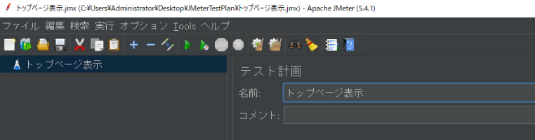
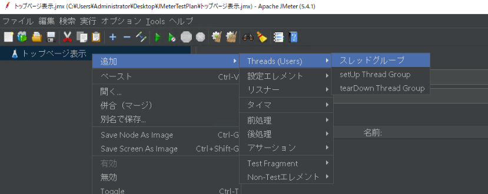
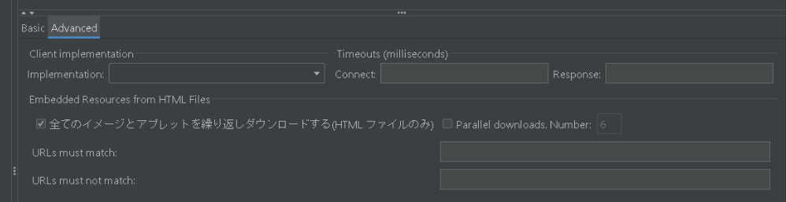

# [実践] JMeterを使ってAWS環境Webアプリケーションを性能検証する④ JMeterシナリオ作成

前回で環境構築を完了し、今回は JMeter シナリオ作成の方法を解説していきます。

# ツアー予約システム

まず、本システムの概要を説明し、性能試験用のデータを作成します。

## 機能一覧
1. ユーザ登録機能
1. ユーザログイン／ログアウト機能
1. ツアー検索機能
1. ツアー詳細表示機能
1. ツアー予約機能
1. ツアー予約照会/キャンセル機能

本記事のシナリオ作成は、特にアクセスが多くなるトップページ表示と、
2. ログインログアウト、3. ツアー検索、4. ツアー詳細表示 を対象とします。

## テーブル一覧

テーブル一覧は以下です。

|テーブル|固定データ|説明|
|-|-|-|
|出発地テーブル|○|北海道～沖縄 までの47都道府県|
|目的地テーブル|○|北海道～沖縄 までの47都道府県|
|宿泊施設テーブル|-|宿泊施設情報|
|年令区分テーブル|○|大人, 小人|
|社員テーブル|-|サイト管理者|
|顧客テーブル|-|エンドユーザ|
|ツアーテーブル|-|ツアー情報|
|ツアー担当者テーブル|-|各ツアーの担当者情報|
|予約テーブル|-|顧客の予約ツアー|

## データの用意

性能試験を実施するにあたり、本番相当数のデータを用意します。
以下のテーブルについて、SQLスクリプトを用いてダミーデータを投入します。

|テーブル|データ件数|SQLファイル|
|-|-|-|
|宿泊施設テーブル|5000件|00220_insert_accommodation.sql|
|顧客テーブル|10万件|00250_insert_customer.sql|
|ツアーテーブル|約150万件|00260_insert_tourinfo.sql|
|ツアー担当者テーブル|約180万件|00270_insert_tourcon.sql|

SQLスクリプトは、aws_performance_test/03_JMeter フォルダ中にあります。
スクリプトの中身は、TERASOLUNAリポジトリのデータ初期化用スクリプトを
参考にしているため、説明は割愛します。（参考[[1]](https://github.com/terasolunaorg/terasoluna-tourreservation/tree/master/terasoluna-tourreservation-initdb/src/main/sqls/postgres)）


構成管理サーバから DB サーバにログインし、SQLスクリプトを実行します。
上表の通りにデータが挿入されていれば OK です。

```sh:構成管理サーバ
$ cd ~
$ psql -h local.db.tourreserve.com -U postgres -d tourreserve
Password for user postgres: P0stgres
tourreserve=> \i ~/aws_performance_test/03_JMeter/00220_insert_accommodation.sql
tourreserve=> select count(*) from accommodation;
 count
-------
  5000
(1 row)
tourreserve=> \i ~/aws_performance_test/03_JMeter/00250_insert_customer.sql
tourreserve=> select count(*) from customer;
 count
--------
 100000
(1 row)
tourreserve=> \i ~/aws_performance_test/03_JMeter/00260_insert_tourinfo.sql
tourreserve=> select count(*) from tourinfo;
  count
---------
 0000821748
(1 row)
tourreserve=> \i ~/aws_performance_test/03_JMeter/00270_insert_tourcon.sql
tourreserve=> select count(*) from tourcon;
  count
---------
 964931
(1 row)
```

# JMeterシナリオ作成

いよいよ、JMeter でシナリオ作成していきます。
練習で各機能のシナリオを作成したのちに、性能検証用シナリオを作成します。

こちらの技術ブログを参考にいたしました。
https://blackbird-blog.com/jmeter-01

JMeter クライアントに RDP 接続し、デスクトップにフォルダ「JMeterTestPlan」を作成してください。
その後、JMeter-Client をクリックし、起動してください。


起動後、オプションから日本語を選択します。
必要に応じて、オプション -> ズームインで画面拡大してください。


## 練習① トップページ表示

まず、トップページの表示のみをテストします。（参考[[2]](https://blackbird-blog.com/jmeter-01)）

テスト計画名を「トップページ表示」にして、テスト計画ファイルをフォルダ「JMeterTestPlan」内に保存してください。



### シナリオ作成

「トップページ表示」を右クリックし、スレッドグループを追加します。
このスレッドグループの名前も「トップページ表示」としてください。




スレッドグループを右クリックし、HTTPリクエストを追加します。


HTTPリクエストは以下のように設定してください。

* 名前：トップページ表示
* Basic
	* プロトコル：HTTP
	* サーバ名またはIP：local.www.tourreserve.com
	* ポート番号：80
	* パス：/terasoluna-tourreservation-web/

* Advanced
	* 全てのイメージとアプレットを繰り返しダウンロードする：チェック




その後、スレッドグループを右クリックし、「結果をツリーで表示」「統計レポート」を追加します。
これらはHTTPリクエストに対するレスポンス結果の確認用として使用します。


### シナリオ実行


## ログイン/ログアウト
https://blackbird-blog.com/jmeter-02
https://blackbird-blog.com/jmeter-login-case01
https://blackbird-blog.com/jmeter-login-case02

## ツアー検索/詳細表示

## ユーザログイン


# 参考

[1] [TERASOLUNAリポジトリ データ初期化用スクリプト](https://github.com/terasolunaorg/terasoluna-tourreservation/tree/master/terasoluna-tourreservation-initdb/src/main/sqls/postgres)
[2] [【簡単】Webシステムの負荷テストツール（JMeter）の使い方 ](https://blackbird-blog.com/jmeter-01)