# [実践] JMeterを使ってAWS環境Webアプリケーションを性能検証する④ JMeterシナリオ作成

前回で環境構築を完了したので、今回は JMeter シナリオ作成の方法を解説していきます。

JMeter シナリオ作成の練習を3パターン行い、本試験用のシナリオ作成は次回といたします。

本記事で作成したファイルは、[githubリポジトリの 03_JMeter フォルダ](https://github.com/muroya2355/aws_performance_test/tree/master/03_JMeter)中にもあります。

# ツアー予約システム

まず、本システムの概要を説明し、性能試験用のデータを作成します。

## 機能一覧
1. ユーザ登録機能
1. ユーザログイン／ログアウト機能
1. ツアー検索機能
1. ツアー詳細表示機能
1. ツアー予約機能
1. ツアー予約照会/キャンセル機能

本記事のシナリオ作成は、特にアクセスが多くなるトップページ表示と、
2. ログインログアウト、3. ツアー検索、4. ツアー詳細表示 を対象とします。

## テーブル一覧

テーブル一覧は以下です。

|テーブル|固定データ|説明|
|-|-|-|
|出発地テーブル|○|北海道～沖縄 までの47都道府県|
|目的地テーブル|○|北海道～沖縄 までの47都道府県|
|宿泊施設テーブル|-|宿泊施設情報|
|年令区分テーブル|○|大人, 小人|
|社員テーブル|-|サイト管理者|
|顧客テーブル|-|エンドユーザ|
|ツアーテーブル|-|ツアー情報|
|ツアー担当者テーブル|-|各ツアーの担当者情報|
|予約テーブル|-|顧客の予約ツアー|

## データの用意

性能試験を実施するにあたり、本番相当数のデータを用意します。

以下のテーブルについて、SQLスクリプトを用いてダミーデータを投入します。

|テーブル|データ件数|SQLファイル|
|-|-|-|
|宿泊施設テーブル|5000件|00220_insert_accommodation.sql|
|顧客テーブル|10万件|00250_insert_customer.sql|
|ツアーテーブル|約150万件|00260_insert_tourinfo.sql|
|ツアー担当者テーブル|約180万件|00270_insert_tourcon.sql|

SQLスクリプトは、aws_performance_test/03_JMeter フォルダ中にあります。

スクリプトの中身は、TERASOLUNAリポジトリのデータ初期化用スクリプトを
参考にしているため、説明は割愛します。（参考[[1]](https://github.com/terasolunaorg/terasoluna-tourreservation/tree/master/terasoluna-tourreservation-initdb/src/main/sqls/postgres)）


構成管理サーバから DB サーバにログインし、SQLスクリプトを実行します。
上表の通りにデータが挿入されていれば OK です。

```sh:構成管理サーバ
$ cd ~
$ psql -h local.db.tourreserve.com -U postgres -d tourreserve
Password for user postgres: P0stgres
tourreserve=> \i ~/aws_performance_test/03_JMeter/00220_insert_accommodation.sql
tourreserve=> select count(*) from accommodation;
 count
-------
  5000
(1 row)
tourreserve=> \i ~/aws_performance_test/03_JMeter/00250_insert_customer.sql
tourreserve=> select count(*) from customer;
 count
--------
 100000
(1 row)
tourreserve=> \i ~/aws_performance_test/03_JMeter/00260_insert_tourinfo.sql
tourreserve=> select count(*) from tourinfo;
  count
---------
 0000821748
(1 row)
tourreserve=> \i ~/aws_performance_test/03_JMeter/00270_insert_tourcon.sql
tourreserve=> select count(*) from tourcon;
  count
---------
 964931
(1 row)
```

# JMeterシナリオ作成

いよいよ、JMeter でシナリオ作成していきます。

こちらの技術ブログを参考にいたしました。

https://blackbird-blog.com/jmeter-01

JMeter クライアントに RDP 接続し、デスクトップにフォルダ「JMeterTestPlan」を作成してください。

その後、JMeter-Client をクリックし、起動してください。


起動後、オプションから日本語を選択します。
必要に応じて、オプション -> ズームインで画面拡大してください。


## 練習① トップページ表示

まず、トップページの表示のみをテストします。（参考[[2]](https://blackbird-blog.com/jmeter-01)）

テスト計画名を「トップページ表示」にして、テスト計画ファイルをフォルダ「JMeterTestPlan」内に保存してください。


### シナリオ作成

「トップページ表示」を右クリックし、スレッドグループを追加します。

このスレッドグループの名前も「トップページ表示」としてください。


スレッドグループを右クリックし、HTTPリクエストを追加します。

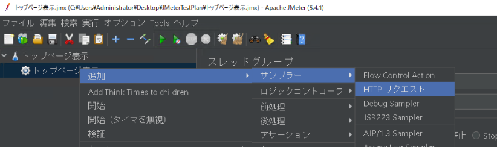

HTTPリクエストは以下のように設定してください。

* 名前：トップページ表示
* Basic
	* プロトコル：HTTP
	* サーバ名またはIP：local.www.tourreserve.com
	* ポート番号：80
	* パス：/terasoluna-tourreservation-web/

* Advanced
	* 全てのイメージとアプレットを繰り返しダウンロードする：チェック


その後、スレッドグループを右クリックし、「結果をツリーで表示」「統計レポート」を追加します。

これらはHTTPリクエストに対するレスポンス結果の確認用として使用します。


### シナリオ実行

いよいよシナリオ実行していきます。

スレッドグループに移動し、「ループ回数」を「10」に設定してください。

その後、「実行」メニューから「開始」をクリックします。

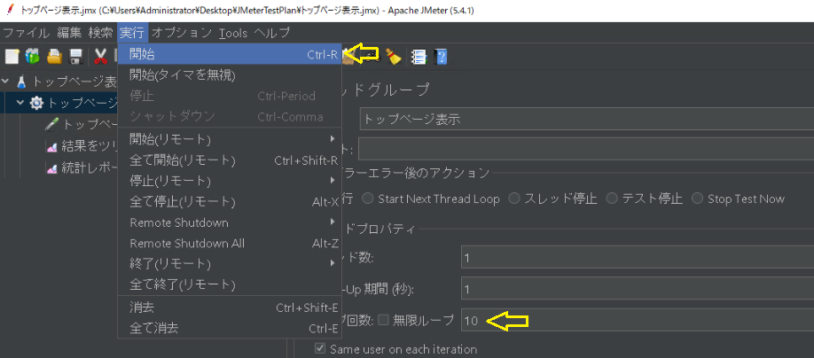

「結果をツリーで表示」をクリックして結果を確認してください。

トップページ表示のリクエスト結果が10回、すべて緑となっていたら成功です。


「応答データ」タブをクリックし、表示形式を「HTML」にすると、HTMLレンダリング結果が表示されます。

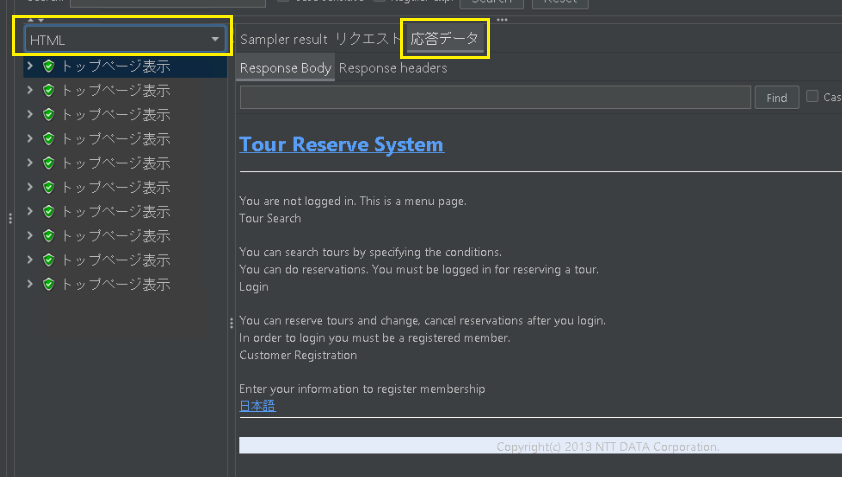

「統計レポート」をクリックすると、負荷掛けの統計情報を確認できます。


実行結果は、「実行」メニューの「すべて消去」でリセットできます。


### 負荷量の調整

負荷量はスレッドグループ設定から変更することができます。（参考[[3]](https://christina04.hatenablog.com/entry/2017/10/03/190000)）

* スレッド数
	- 起動するスレッド数 ≒ 仮想ユーザ数

* ループ回数
	- テスト・シナリオの実行回数
	- [無限ループ]にチェックを入れると無限にテスト

* Ramp-up期間（秒で指定）
	- 多重度（仮想ユーザ数）を徐々に増加させるためのパラメタ。

パラメータの関係はこちらのサイトが分かりやすいです。（参考[[3]](https://christina04.hatenablog.com/entry/2017/10/03/190000)）

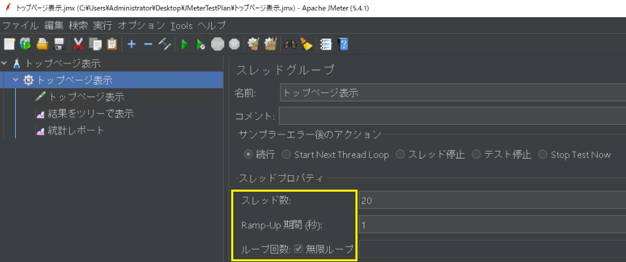

負荷掛け実行中に停止する場合は、停止ボタン、または「実行」メニューから「停止」をクリックします。

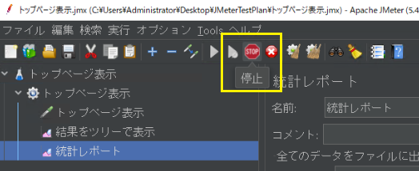

これでトップページ表示のシナリオ練習は完了です。

## 練習② ログイン/ログアウト

ログイン/ログアウトのシナリオを作成してみましょう。

予備知識として、下記の記事を読んでおくと理解が進みます。（説明丸投げ）

https://blackbird-blog.com/jmeter-02

https://blackbird-blog.com/jmeter-login-case01

https://blackbird-blog.com/jmeter-login-case02

これらの内容を、今回のシステム用にカスタマイズしていきます。

### プロキシサーバによるシナリオ記録

別のテスト計画ファイル「ログイン_ログアウト」を作成し、その中に同名のスレッドグループを作成します。

スレッドグループ中に、シナリオ記録用のシンプルコントローラを追加します。

また、テスト計画中に HTTPプロキシサーバを追加します。


プロキシサーバの設定で、対象となるコントローラに先述のコントローラを指定します。


シナリオ記録するために、Windows でプロキシ設定を行います。

下図のようにプロキシ設定し、「保存」ボタンをクリックします。


シナリオ記録の準備ができました。

プロキシサーバの開始ボタンをクリックします。


まずはブラウザでトップページにアクセスします。

シンプルコントローラ配下にHTTPリクエストが追加されていることを確認してください。

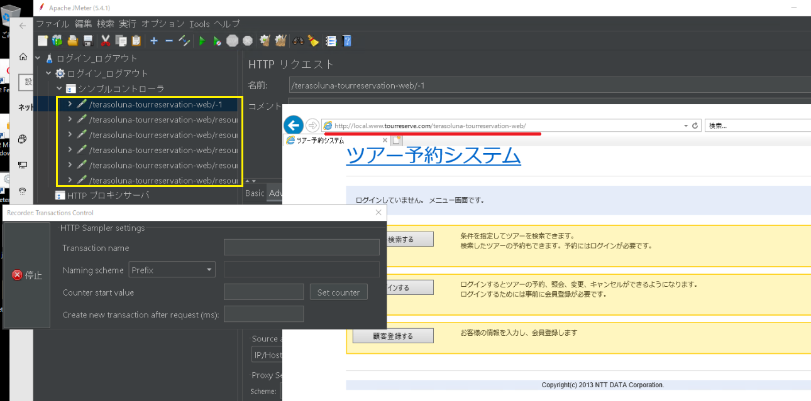

その後、ログイン画面に移動します。

以下のユーザ情報を入力し、「ログイン」ボタンをクリックしてください。

* 会員ID：00000001
* パスワード：password

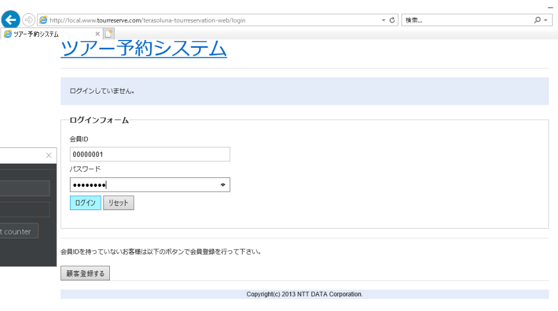

ログイン後、メニュー画面に遷移するので、「ツアー検索する」→「ログアウト」をクリックしてログアウトします。

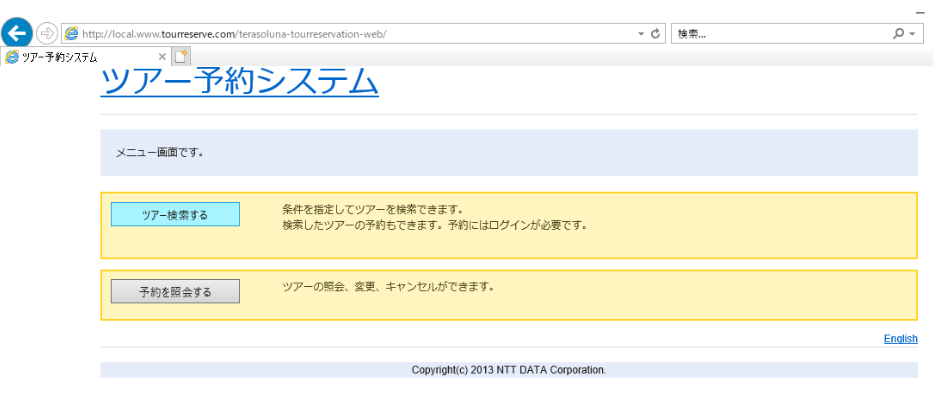


シナリオは以上です。レコーダ画面で停止ボタンを押して記録終了します。

Windows のプロキシ設定も元に戻してください。


記録されたHTTPリクエスト内容が分かりやすいよう、適宜名前を付けていきましょう。


* ※リクエストの共通部分
	* プロトコル：HTTP
	* サーバ名またはIP：local.www.tourreserve.com
	* ポート番号：80

* トップページ表示
	* メソッド：GET
	* パス：/terasoluna-tourreservation-web/
	* パラメータ：なし

* ログイン画面表示
	* メソッド：GET
	* パス：/terasoluna-tourreservation-web/login
	* パラメータ：なし

* ログイン
	* メソッド：POST
	* パス：/terasoluna-tourreservation-web/login
	* パラメータ：
		* username：00000001
		* password：password
		* redirectTo：[空]
		* _csrf：[xxxxxxxx-xxxx-....]

* ログイン後トップページ表示
	* メソッド：GET
	* パス：/terasoluna-tourreservation-web/
	* パラメータ：なし

* ツアー検索画面表示
	* メソッド：GET
	* パス：/terasoluna-tourreservation-web/tours
	* パラメータ：
		* initform：[空]

* ログアウト
	* メソッド：POST
	* パス：/terasoluna-tourreservation-web/logout
	* パラメータ：
		* logout：[空]
		* _csrf：[xxxxxxxx-xxxx-....]

* ログアウト後トップページ表示
	* メソッド：GET
	* パス：/terasoluna-tourreservation-web/
	* パラメータ：なし

### シナリオ中のパラメータ設定

まず、セッションを保持するためにHTTPクッキーマネージャを追加します。

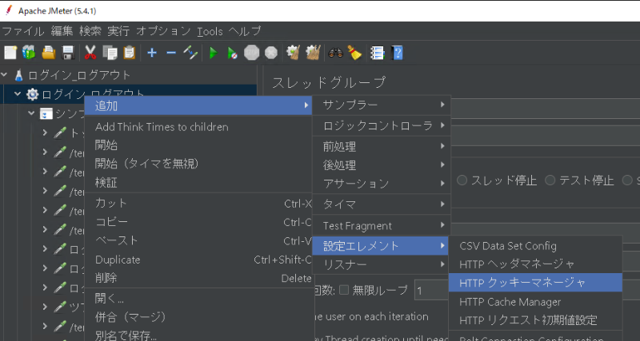

ログイン、ログアウトに使われるリクエストパラメータを変数化していきましょう。

まず、ログインリクエストに移動し、リクエストパラメータの内容を変数に書き換えます。

* username：${username}
* password：${password}
* _csrf：${csrf_token}

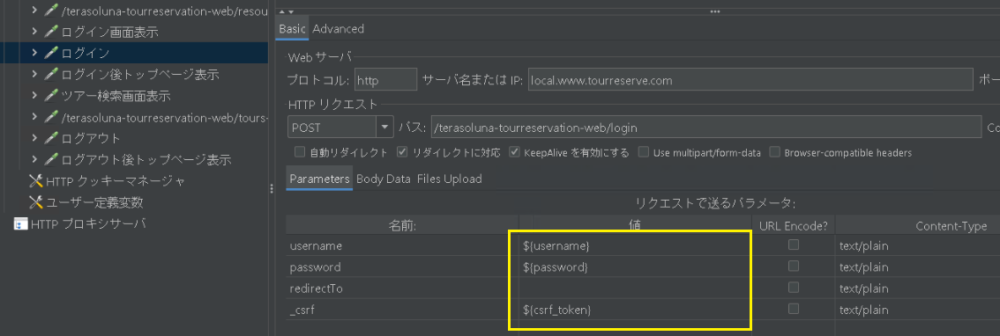

ユーザ、パスワードは、ユーザ定義変数で指定します。

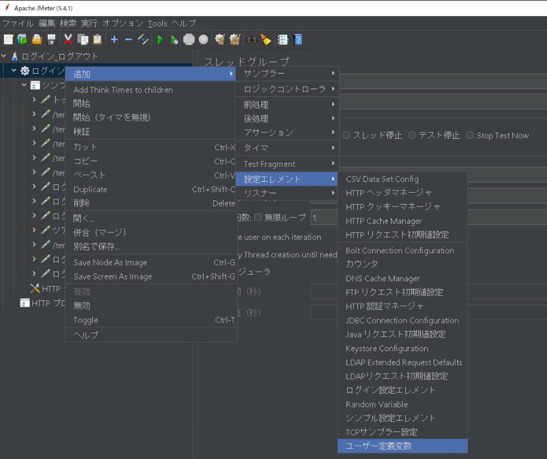

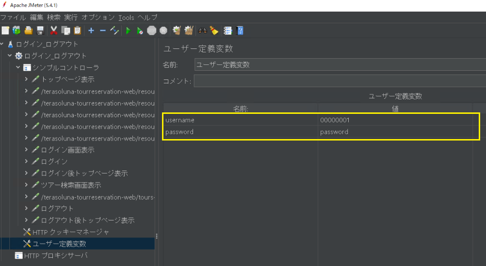

CSRFトークンについては、ユーザ定義変数で指定できず、前のページ（ログイン画面）からトークンを引継ぐ必要があります。


ログイン画面表示リクエストに、「正規表現抽出」を追加します。

正規表現抽出中に、以下の設定を入れてください。

* 参照名：csrf_token
* 正規表現：\<input type="hidden" name="_csrf" value="(.*)" />
* テンプレート：\$1$

*↑ ブラウザ表示されるレスポンスと形式が異なるので注意*

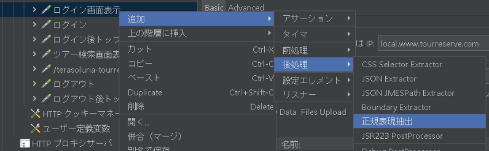

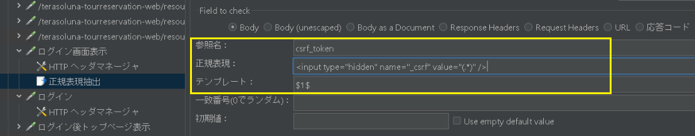

ログアウトについても同様に CSRFトークンの設定を行います。


ここまで出来たら、ようやく負荷掛け可能になります。
スレッドグループから、「結果をツリーで表示」「統計レポート」を追加し、シナリオ実行します。
全てのリクエストが緑色になっていたら成功です。

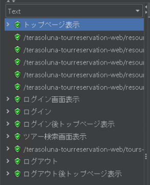

各リクエストのレスポンスをHTML表示して、それぞれのページが表示されていることを確認します。

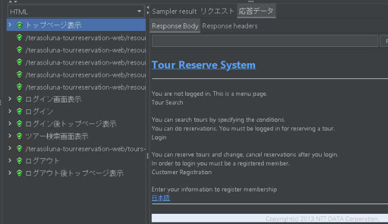 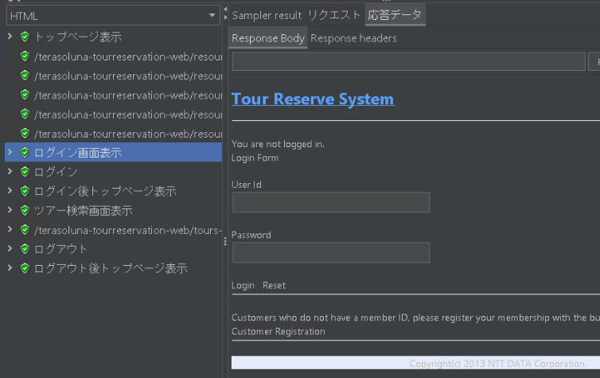
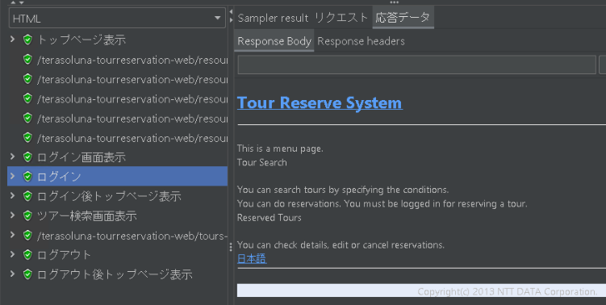

統計レポートでは、それぞれのリクエストに対するレスポンス情報が確認できます。


### ファイルからのパラメータ読み込み

実際の負荷掛けでは、ユーザは単一でなく、複数で負荷掛けをします。

ユーザ定義変数で何ユーザも追加するのは大変なので、CSVファイルからのパラメータ読み込むように設定します。

CSVファイルは以下のように、ユーザIDとパスワードを100人分記述します。

このファイルを、デスクトップの「JMeterTestPlan」に配置してください。

```ユーザ一覧.csv
00000001,password
00000002,password
00000003,password
...
00000100,password
```

先ほど設定したユーザ定義変数を無効化し、代わりに「CSV Data Set Config」を追加します。


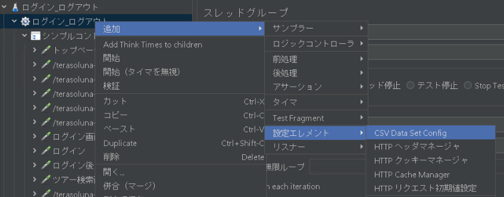

Config の設定は以下になります。

* FileName：C:/Users/Administrator/Desktop/JMeterTestPlan/ユーザ一覧.csv
* File encoding：UTF-8
* Variable Name：username,password
* Delimiter：,


スレッドグループ設定を、スレッド数：1, Ramp Up期間：1, ループ回数：10 にしてシナリオ実行してみます。

全リクエストが緑色で、ログインでのユーザIDが毎回異なることを確認してください。


これでようやく練習②が完了です。

## 練習③ ツアー検索/詳細表示

最後に、ツアー検索/詳細表示のシナリオを作成します。基本的には練習② と同じ流れです。

新しくテスト計画「ツアー検索_詳細表示」を作成してください。

### シナリオ記録

テスト計画に HTTP プロキシを追加し、シナリオ記録していきます。
（プロキシ設定を忘れずに）

トップページ表示


ツアー検索画面表示（検索条件は赤線の通り）

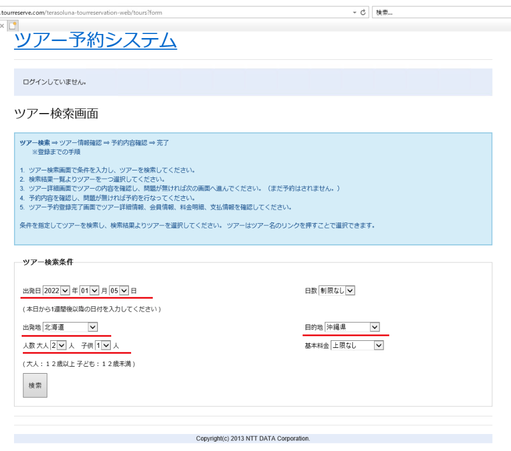

ツアー検索結果画面表示（連番No.1をクリック）


ツアー詳細画面表示

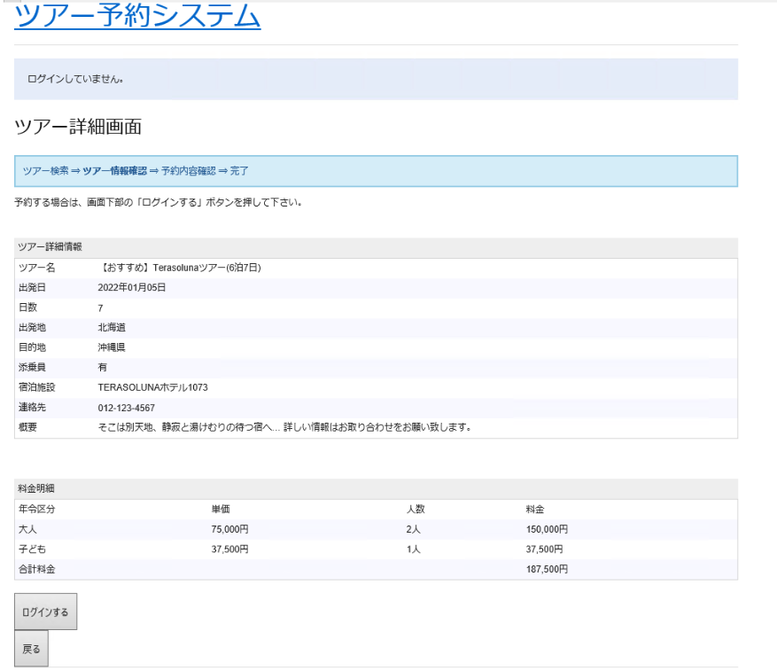

シナリオ記録を終了し、リクエストに名前を付けていきます。


### パラメータ設定

ツアー検索条件や、CSRFトークン等のパラメータ設定を行います。

ツアー検索結果画面表示
（検索条件をリクエストパラメータに、検索結果のツアーIDを正規表現抽出する）


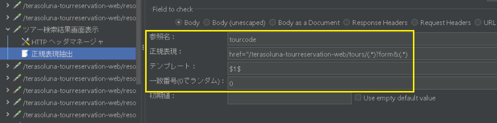

ツアー詳細画面表示
（ツアーIDと検索条件をリクエストパラメータにする）

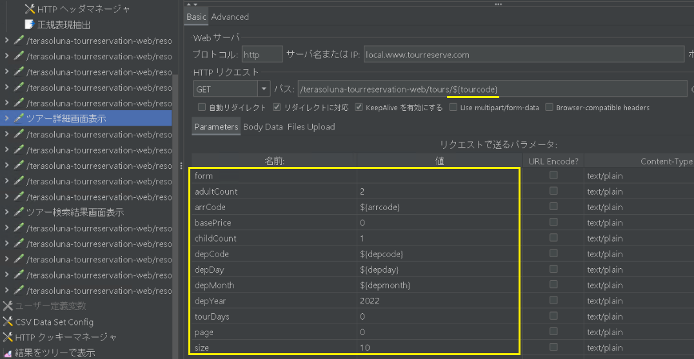

### ファイルからのパラメータ読み込み

ツアー検索条件のファイル取り込み設定を行います。

CSVファイルに以下を記載していきます。

* 月：1月のみ対象なので、1を指定
* 日：1 から 31 の中からランダムに指定
* 出発地コード：1 から 47 の中からランダムに指定、2桁ゼロ埋め
* 到着地コード：1 から 47 の中からランダムに指定、2桁ゼロ埋め

```ツアー検索条件一覧.csv
1,31,27,09
1,9,13,23
1,2,25,10
1,14,41,47
1,8,47,02
```

CSV Data Set Config を追加し、以下の設定を行います。

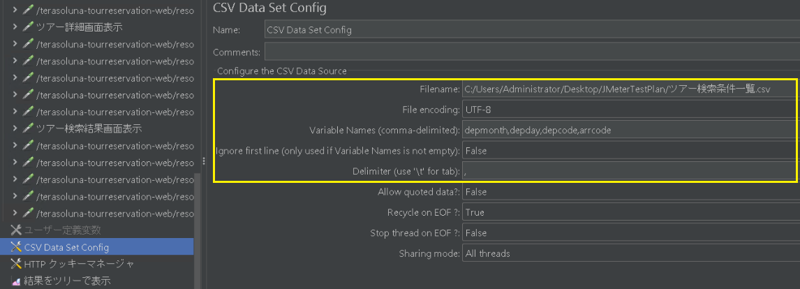

### シナリオ実行

スレッドグループ設定を、スレッド数：1, Ramp Up期間：1, ループ回数：10 にしてシナリオ実行してみます。

全リクエストが緑色であること、ツアー検索/詳細表示のリクエストパラメータが毎回異なることを確認してください。

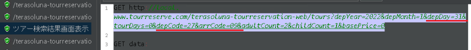


これで練習③は完了です。

# さいごに

この後、本試験用のシナリオを作る予定でしたが、あまりにも長くなりすぎたので次回といたします。

次回は性能目標の計画とシナリオ作成、また性能測定を行う予定です。

# 参考

[1] [TERASOLUNAリポジトリ データ初期化用スクリプト](https://github.com/terasolunaorg/terasoluna-tourreservation/tree/master/terasoluna-tourreservation-initdb/src/main/sqls/postgres)
[2] [【簡単】Webシステムの負荷テストツール（JMeter）の使い方 ](https://blackbird-blog.com/jmeter-01)
[3] [負荷ツールのスレッド数・Ramp-Up期間・ループ回数の関係](https://christina04.hatenablog.com/entry/2017/10/03/190000)
[4] [JMeterの簡単なシナリオの作り方](https://blackbird-blog.com/jmeter-02)
[5] [JMeterでログインが必要なシステムのシナリオの作り方](https://blackbird-blog.com/jmeter-login-case01)
[6] [JMeterでログインするユーザを複数指定する方法](https://blackbird-blog.com/jmeter-login-case02)