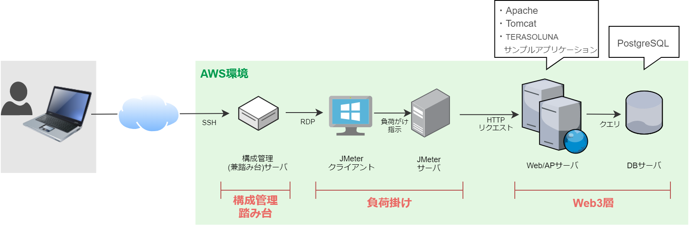

# [実践] JMeterを使ったAWS環境Webアプリケーションの性能検証①

システムパフォーマンスの本を読んで、自分も検証してみたい！と思ったけど、環境構築が手間で諦めた。。。という人、多いと思います。

本記事では、性能検証のための環境構築と、検証の観点について記載いたします。お役に立てたら幸いです。

# システム概要

* 本システムは、構成管理兼踏み台、負荷掛け、Web3層の3つのパートからなります。
* AWSの構成管理には CloudFormation を、各サーバのミドルウェアの管理には Ansible を使用します。
* Webアプリへの負荷掛けは JMeter サーバ/クライアントを通して行います。
* Webサーバには Apache httpd と Tomcat、アプリケーションは TERASOLUNAサンプルアプリケーションを使用します。https://github.com/terasolunaorg/terasoluna-tourreservation
* DBエンジンは PostgreSQL を採用します。

# 目次

* 性能検証の進め方は、[「Amazon Web Services負荷試験入門」](https://gihyo.jp/book/2017/978-4-7741-9262-8 "Amazon Web Services負荷試験入門")を参考にしました。

* 環境構築、性能検証に用いるファイルは[githubリポジトリ](https://github.com/muroya2355/aws_performance_test)で公開しています。

## ①導入
* 本ページです。

## ②環境構築（1）AWS編
* CloudFormation を用いて、ELB + EC2 + RDS のオーソドックスな AWS システムを構築します。AWS構成図は以下になります。

## ③環境構築（2）Ansible編
* 構成管理サーバの Ansible を用いて、各サーバをプロビジョニングしていきます。ソフトウェア構成図は以下。

## ④JMeterシナリオ作成、動作確認
* 今回のサンプルアプリケーションに合わせた JMeter のシナリオ作成と、軽い負荷掛けで動作確認を行います。

## ⑤性能検証（1）性能目標に向けたチューニング
* あらかじめ性能目標を立てておき、それを満たすようにチューニングを行います。（アプリケーションには手を加えず、インフラ面でのチューニングを行います。）

## ⑥性能検証（2）限界スループット確認
* 更にチューニング、スケールアップ等を行い、本システムの限界性能を確かめます。
